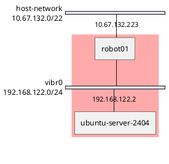
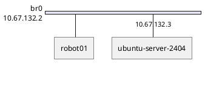

---
# You can also start simply with 'default'
theme: seriph
# random image from a curated Unsplash collection by Anthony
# like them? see https://unsplash.com/collections/94734566/slidev
background: https://cover.sli.dev
# some information about your slides (markdown enabled)
title: Welcome to Slidev
info: |
  ## Slidev Starter Template
  Presentation slides for developers.

  Learn more at [Sli.dev](https://sli.dev)
# apply unocss classes to the current slide
class: text-center
# https://sli.dev/features/drawing
drawings:
  persist: false
# slide transition: https://sli.dev/guide/animations.html#slide-transitions
transition: slide-left
# enable MDC Syntax: https://sli.dev/features/mdc
mdc: true
# open graph
# seoMeta:
#  ogImage: https://cover.sli.dev
---

# Virtual Machines with KVM/QEMU

Presentation slides for developers

<div @click="$slidev.nav.next" class="mt-12 py-1" hover:bg="white op-10">
  Press Space for next page <carbon:arrow-right />
</div>

<div class="abs-br m-6 text-xl">
  <button @click="$slidev.nav.openInEditor()" title="Open in Editor" class="slidev-icon-btn">
    <carbon:edit />
  </button>
  <a href="https://github.com/slidevjs/slidev" target="_blank" class="slidev-icon-btn">
    <carbon:logo-github />
  </a>
</div>

<!--
The last comment block of each slide will be treated as slide notes. It will be visible and editable in Presenter Mode along with the slide. [Read more in the docs](https://sli.dev/guide/syntax.html#notes)
-->

---

# Introduction

Difference from other guides online:
- Command-line focused (no virt-manager)
- UEFI first (no legacy BIOS)
- Works on both amd64 and arm64
- GPU friendly
- Robot focused

---

# 🧠 What is libvirtd?

- `libvirtd` is the **daemon component** of the **libvirt** virtualization API and management toolset.
- It provides a **centralized service** that manages virtual machines, storage pools, networks, etc.
- It exposes a **standard API** over various protocols (e.g., UNIX socket, TCP) that tools like `virsh`, `virt-manager`, and OpenStack use.

---

# 🕰️ Historical Timeline

| Year      | Event                       |
| --------- | --------------------------- |
| 2005      |Red Hat engineer Daniel Veillard (of GNOME/XMMS fame) began work on **libvirt** as an abstraction layer over virtualization tools, primarily to support **Xen** initially. |
| 2006-2007 | `libvirt` added support for **KVM**, which was merged into the Linux kernel in 2007. |
| 2008+     | `libvirt` and `libvirtd` became core to virtualization stacks across Linux distributions (e.g., Red Hat, Ubuntu, SUSE).|
| 2020+     | `libvirtd` was deprecated in favor of **modular systemd socket-activated daemons**, like `virtnodedevd`, `virtqemud`, etc., starting with **libvirt 6.0+**.|

---

🧾 Key virsh-specific Terminology (1 of 2)

| Term          | Meaning/Equivalent      | Description |
| ------------- | ----------------------- | ----------- |
| **domain**      | Virtual Machine         | A running or defined guest. This is virsh’s generic term for a VM, regardless of hypervisor. |
| **network**      | Virtual Network         | A software-defined virtual bridge or NAT network managed by libvirt. Often backed by dnsmasq. |
| **pool**         | Storage Pool            | A collection of storage volumes, like a directory, LVM group, or iSCSI target. |
| **volume**       | Disk image/storage      | A single disk image or logical unit inside a pool (e.g., a qcow2 or raw disk image).|

---

🧾 Key virsh-specific Terminology (2 of 2)

| Term          | Meaning/Equivalent      | Description |
| ------------- | ----------------------- | ----------- |
| **interface**    | Physical or virtual NIC | Refers to host interfaces, not guest NICs. |
| **snapshot**     | VM snapshot             | A saved VM state (RAM + disk state, if supported). |
| **capabilities** | Host features           | Includes CPU models, virtualization extensions, emulator binaries, etc. |

---

# Install QEMU/KVM on Ubuntu 24.04

Install QEMU/KVM and libvirtd

```bash
sudo apt-get update
sudo apt-get install qemu-kvm libvirt-daemon-system
sudo apt-get install virtinst
```

Make sure the current user is a member of the libvirt and kvm groups

```bash
$ sudo adduser $(id -un) libvirt
Adding user '<username>' to group 'libvirt' ...
$ sudo adduser $(id -un) kvm
Adding user '<username>' to group 'kvm' ...
```

Be sure to reboot!!!!

```bash
sudo reboot
```

---

# Validate config

```bash
$ virt-host-validate qemu
```

X86_64-based machines will likely display a warning about cgroup devices controller support not being enabled. This allows you to apply resource management to virtual machines. For more information refer to this doc. To add cgroup 'devices' controller support, edit /etc/default/grub and change the line that looks like GRUB_CMDLINE_LINUX_DEFAULT="quiet splash" to:

```bash
# GRUB_CMDLINE_LINUX_DEFAULT="quiet splash"
GRUB_CMDLINE_LINUX_DEFAULT="quiet splash intel_iommu=on systemd.unified_cgroup_hierarchy=0"
```

```bash
sudo update-grub
```

---

# Virtual Bridge 0 - NAT interface




---

# Virtual Bridge 0 - NAT interface

```bash
$ cat /usr/share/libvirt/networks/default.xml
<network>
  <name>default</name>
  <bridge name='virbr0'/>
  <forward/>
  <ip address='192.168.122.1' netmask='255.255.255.0'>
    <dhcp>
      <range start='192.168.122.2' end='192.168.122.254'/>
    </dhcp>
  </ip>
</network>
```

```bash
$ ip -br a
lo               UNKNOWN        127.0.0.1/8 ::1/128
enp113s0         DOWN
eno1             UP             10.67.132.223/22 metric 100 fe80::a6ae:11ff:fe1e:48fa/64
wlp4s0           DOWN
virbr0           DOWN           192.168.122.1/24
```

```bash
$ virsh net-list --all
 Name      State    Autostart   Persistent
--------------------------------------------
 default   active   yes         yes
```

---

# Storage pools

Images
```bash
$ virsh pool-define-as \
    --name default \
    --type dir \
    --target /var/lib/libvirt/images
$ virsh pool-build default
$ virsh pool-start default
$ virsh pool-autostart default
```

```bash
$ virsh pool-list --all
$ virsh vol-list --pool default --details
```

---

# cloud-init image pool

Note: There is a --cloud-init parameter for virt-install to auto-generate the cloud-init ISO. It creates a pool called boot-scratch in /var/lib/libvirt/boot. However oftentimes it's just easier to control the lifecycle of these images manually

```bash
$ virsh pool-define-as \
    --name boot-scratch \
    --type dir \
    --target /var/lib/libvirt/boot
$ virsh pool-build boot-scratch
$ virsh pool-start boot-scratch
$ virsh pool-autostart boot-scratch
```

```bash
$ virsh pool-list --all
$ virsh vol-list --pool boot-scratch --details
```

---

# ISO image pool

```bash
$ virsh pool-define-as \
    --name iso \
    --type dir \
    --target /var/lib/libvirt/iso
$ virsh pool-build iso
$ virsh pool-start iso
$ virsh pool-autostart iso
```

```bash
$ virsh pool-list --all
$ virsh vol-list --pool iso --details
```

---

# Ubuntu cloud images

https://cloud-images.ubuntu.com/

- Fast to spin up and minimal
- Do not come pre-configured with a default login
- Minimal drivers/hardware support out of the box

---

# Download cloud image template and resize

```bash
curl -LO https://cloud-images.ubuntu.com/noble/current/noble-server-cloudimg-amd64.img
```

```
$ qemu-img info noble-server-cloudimg-amd64.img
$ sudo qemu-img convert \
  -f qcow2 -O qcow2 \
  noble-server-cloudimg-amd64.img \
  /var/lib/libvirt/images/ubuntu-server-2404.qcow2
$ sudo qemu-img resize -f qcow2 \
  /var/lib/libvirt/images/ubuntu-server-2404.qcow2 \
  32G
```

---

# Define login parameters for cloud-init ISO

```bash
touch network-config

cat >meta-data <<EOF
instance-id: ubuntu-server-2404
local-hostname: ubuntu-server-2404
EOF

cat >user-data <<EOF
#cloud-config
password: superseekret
chpasswd:
  expire: false
ssh_pwauth: true
EOF
```

---

# Generate cloud-init ISO

```bash
sudo apt-get update
sudo apt-get install genisoimage
```

```bash
$ genisoimage \
    -input-charset utf-8 \
    -output ubuntu-server-2404-cloud-init.img \
    -volid cidata -rational-rock -joliet \
    user-data meta-data network-config

sudo cp ubuntu-server-2404-cloud-init.img \
  /var/lib/libvirt/boot/ubuntu-server-2404-cloud-init.iso
```

---

# Spin up image and configure with cloud-init

```bash
virt-install \
  --connect qemu:///system \
  --name ubuntu-server-2404 \
  --boot uefi \
  --memory 2048 \
  --vcpus 2 \
  --os-variant ubuntu24.04 \
  --disk /var/lib/libvirt/images/ubuntu-server-2404.qcow2,bus=virtio \
  --disk /var/lib/libvirt/boot/ubuntu-server-2404-cloud-init.iso,device=cdrom \
  --network network=default,model=virtio \
  --graphics spice \
  --noautoconsole \
  --console pty,target_type=serial \
  --import \
  --debug
```

---

# Accessing image

```bash
virsh console ubuntu-server-2404
```

```bash
virt-viewer ubuntu-server-2404
```

---

# Disable cloud-init and remove cloud-init ISO

```bash
# login with ubuntu user
$ cloud-init status
status: done

# Disable cloud-init
$ sudo touch /etc/cloud/cloud-init.disabled

$ sudo apt-get update
$ sudo apt-get install qemu-guest-agent

$ sudo shutdown -h now
```

```bash
$ virsh domblklist ubuntu-server-2404
$ virsh change-media ubuntu-server-2404 sda --eject
$ sudo rm /var/lib/libvirt/boot/ubuntu-server-2404-cloud-init.iso
```


---

# Snapshots

```bash
$ virsh snapshot-create-as --domain ubuntu-server-2404 --name clean --description "Initial install"
$ virsh snapshot-list ubuntu-server-2404
$ virsh snapshot-revert ubuntu-server-2404 clean
$ virsh snapshot-delete ubuntu-server-2404 clean
```

```bash
$ virsh shutdown ubuntu-server-2404
$ virsh undefine ubuntu-server-2404 --nvram --remove-all-storage
```

---

# Get IP of virtual machine

```bash
virsh start ubuntu-server-2404

virsh list --all
```

```
$ virsh domifaddr ubuntu-server-2404 --source agent
```

```
virsh net-dhcp-leases default
```

```bash
virsh domiflist ubuntu-server-2404
sudo apt-get install net-tools
arp -an
```

---

# If you need additional drivers

```bash
# First try to install the kernel modules package
sudo apt-get update
sudo apt-get install linux-modules-$(uname -r)

# sudo modprobe <kernel_module>

# If that still doesn't work, try installing the full generic kernel image
sudo apt-get install linux-image-generic
# linux-generic-hwe-24.04
sudo reboot
```

---

# br0 - Bridged Networking



---

# Determine networking type

- NetworkManager - normally used on Ubuntu Desktop
- systemd-networkd - normally used on Ubuntu Server

---

NetworkManager check:
```bash
$ nmcli general
STATE      CONNECTIVITY  WIFI-HW  WIFI     WWAN-HW  WWAN    
connected  full          enabled  enabled  enabled  enabled

$ nmcli connection
NAME                UUID                                  TYPE      DEVICE  
Wired connection 1  5297a82f-7244-31f3-9dad-c3fb49be0b33  ethernet  eno1    
docker0             80651a82-b1af-4ed7-a4bb-e0a802d6f012  bridge    docker0 
virbr0              d0da1989-df49-44dc-9c48-aa3c978fbb90  bridge    virbr0

$ networkctl
WARNING: systemd-networkd is not running, output will be incomplete.

IDX LINK      TYPE     OPERATIONAL SETUP    
  1 lo        loopback n/a         unmanaged
  2 eno1      ether    n/a         unmanaged
  3 wlp0s20f3 wlan     n/a         unmanaged
  4 virbr0    bridge   n/a         unmanaged
  5 docker0   bridge   n/a         unmanaged

5 links listed.
```

---

systemd-networkd check
```bash
$ networkctl
IDX LINK  TYPE     OPERATIONAL SETUP
  1 lo    loopback carrier     unmanaged
  2 ens33 ether    routable    configured

2 links listed.
```


---

# Configure bridged networking with NetworkManager (1 of 2)

```bash
$ ip -brief link
lo               UNKNOWN        00:00:00:00:00:00 <LOOPBACK,UP,LOWER_UP> 
ens33            UP             00:0c:29:25:7e:47 <BROADCAST,MULTICAST,UP,LOWER_UP>

$ nmcli connection show --active
NAME                UUID                                  TYPE      DEVICE 
Wired connection 1  779e47c2-776a-3c0a-a498-ebffcbe374c4  ethernet  ens33
```

```bash
$ ls /etc/netplan
01-network-manager-all.yaml
$ cat /etc/netplan/01-network-manager-all.yaml 
# Let NetworkManager manage all devices on this system
network:
  version: 2
  renderer: NetworkManager
```

---

# Configure bridged networking with NetworkManager (2 of 2)

```bash
# This is the network config written by 'subiquity'
network:
  version: 2
  renderer: NetworkManager
  ethernets:
    ens33:
      dhcp4: false
      dhcp6: false
      optional: true
  bridges:
    br0:
      dhcp4: true
      dhcp6: false
      accept-ra: false
      link-local: []
      interfaces:
        - ens33
```

```
$ sudo netplan try
$ sudo netplan apply
```

---

# systemd-networkd -  Configure bridged networking (1 of 3)

```bash
$ ip -brief link
lo               UNKNOWN        00:00:00:00:00:00 <LOOPBACK,UP,LOWER_UP>
ens33            UP             00:0c:29:b6:83:61 <BROADCAST,MULTICAST,UP,LOWER_UP>
```

```bash
$ ls /etc/netplan
00-installer-config.yaml
$ cat /etc/netplan/00-installer-config.yaml
# This is the network config written by 'subiquity'
network:
  ethernets:
    ens33:
      dhcp4: true
  version: 2
```

---

# systemd-networkd - Configure bridged networking (2 of 3)

```bash
# This is the network config written by 'subiquity'
network:
  version: 2
  renderer: networkd
  ethernets:
    ens33:
      dhcp4: false
      dhcp6: false
      optional: true
  bridges:
    br0:
      dhcp4: true
      dhcp6: false
      accept-ra: false
      link-local: []
      interfaces:
        - ens33
```

---

# systemd-networkd - Configure bridged networking (3 of 3)

```
$ sudo netplan try
$ sudo netplan apply
```

```bash
$ networkctl
IDX LINK  TYPE     OPERATIONAL SETUP
  1 lo    loopback carrier     unmanaged
  2 ens33 ether    enslaved    configured
  3 br0   bridge   routable    configured

3 links listed.

$ ip -brief addr
lo               UNKNOWN        127.0.0.1/8 ::1/128
ens33            UP
br0              UP             172.25.0.112/22 metric 100 fe80::f4d4:91ff:feed:5e12/64
```

---

# Create a definition for the host network (1 of 2)

Create XML definition

```bash
cat <<EOF > /tmp/host-network.xml
<network>
  <name>host-network</name>
  <forward mode="bridge"/>
  <bridge name="br0" />
</network>
EOF
```

Configure

```bash
$ sudo virsh net-define /tmp/host-network.xml
$ sudo virsh net-start host-network
$ sudo virsh net-autostart host-network
```

---

# Create a definition for the host network (2 of 2)

Verify

```bash
$ virsh net-list --all
 Name           State    Autostart   Persistent
-------------------------------------------------
 default        active   yes         yes
 host-network   active   yes         yes
```

---

# Download cloud image template and resize

```bash
curl -LO https://cloud-images.ubuntu.com/noble/current/noble-server-cloudimg-amd64.img
```

```bash
$ qemu-img info noble-server-cloudimg-amd64.img
$ sudo qemu-img convert \
    -f qcow2 -O qcow2 \
    noble-server-cloudimg-amd64.img \
    /var/lib/libvirt/images/ubuntu-server-2404.qcow2
$ sudo qemu-img resize -f qcow2 \
    /var/lib/libvirt/images/ubuntu-server-2404.qcow2 \
    32G
```

---

# Define login parameters for cloud-init ISO (1 of 2)

```bash
touch network-config

cat >meta-data <<EOF
instance-id: ubuntu-server-2404
local-hostname: ubuntu-server-2404
EOF
```

---

# Define login parameters for cloud-init ISO (2 of 2)

```bash
cat >user-data <<EOF
#cloud-config
hostname: ubuntu-server-2404
users:
  - name: automat
    uid: 63112
    primary_group: users
    groups: users
    shell: /bin/bash
    plain_text_passwd: superseekret
    sudo: ALL=(ALL) NOPASSWD:ALL
    lock_passwd: false
chpasswd: { expire: False }
ssh_pwauth: True
package_update: False
package_upgrade: false
packages:
  - qemu-guest-agent
growpart:
  mode: auto
  devices: ['/']
power_state:
  mode: reboot
EOF
```

---

# Generate cloud-init ISO

```bash
sudo apt-get update
sudo apt-get install genisoimage
```

```bash
$ genisoimage \
    -input-charset utf-8 \
    -output ubuntu-server-2404-cloud-init.img \
    -volid cidata -rational-rock -joliet \
    user-data meta-data network-config

sudo cp ubuntu-server-2404-cloud-init.img \
  /var/lib/libvirt/boot/ubuntu-server-2404-cloud-init.iso
```

---

# Spin up image and configure with cloud-init (on host-network)

```bash
virt-install \
  --connect qemu:///system \
  --name ubuntu-server-2404 \
  --boot uefi \
  --memory 2048 \
  --vcpus 2 \
  --os-variant ubuntu24.04 \
  --disk /var/lib/libvirt/images/ubuntu-server-2404.qcow2,bus=virtio \
  --disk /var/lib/libvirt/boot/ubuntu-server-2404-cloud-init.iso,device=cdrom \
  --network network=host-network,model=virtio \
  --graphics spice \
  --noautoconsole \
  --console pty,target_type=serial \
  --import \
  --debug
```

---

# Accessing image

```bash
virsh console ubuntu-server-2404
```

```bash
virt-viewer ubuntu-server-2404
```

---

# Disable cloud-init and remove cloud-init ISO

```bash
# login with ubuntu user
$ cloud-init status
status: done

# Disable cloud-init
$ sudo touch /etc/cloud/cloud-init.disabled

$ sudo apt-get update
$ sudo apt-get install qemu-guest-agent

$ sudo shutdown -h now
```

```bash
$ virsh domblklist ubuntu-server-2404
$ virsh change-media ubuntu-server-2404 sda --eject
$ sudo rm /var/lib/libvirt/boot/ubuntu-server-2404-cloud-init.iso
```

---

# Snapshots

```bash
$ virsh snapshot-create-as --domain ubuntu-server-2404 --name clean --description "Initial install"
$ virsh snapshot-list ubuntu-server-2404
$ virsh snapshot-revert ubuntu-server-2404 clean
$ virsh snapshot-delete ubuntu-server-2404 clean
```

```bash
$ virsh shutdown ubuntu-server-2404
$ virsh undefine ubuntu-server-2404 --nvram --remove-all-storage
```

---

# Get IP of virtual machine (bridged networking)

```bash
virsh start ubuntu-server-2404

virsh list --all
```

```
virsh domifaddr ubuntu-server-2404 --source agent
```

```
# Does not work (only for NAT networking)
virsh net-dhcp-leases default
```

```
# Also does not work (only for NAT networking)
virsh domiflist ubuntu-server-2404
sudo apt-get install net-tools
arp -an
```

---

# If you need additional drivers

```
# First try to install the kernel modules package
sudo apt-get update
sudo apt-get install linux-modules-$(uname -r)

# sudo modprobe <kernel_module>

# If that still doesn't work, try installing the full generic kernel image
sudo apt-get install linux-image-generic
# linux-generic-hwe-24.04
sudo reboot
```

---

# Ubuntu autoinstall

- Script Ubuntu manual install with pre-configured answers
- Big install payload, slow to install
- Works on metal
- Complete driver set

---

# Create ISO pool


```bash
virsh pool-define-as iso dir --target "/var/lib/libvirt/iso"
virsh pool-build iso
virsh pool-start iso
virsh pool-autostart iso
```

---

# Docker install

```bash
# Add Docker's official GPG key:
sudo apt-get update
sudo apt-get install ca-certificates curl
sudo install -m 0755 -d /etc/apt/keyrings
sudo curl -fsSL https://download.docker.com/linux/ubuntu/gpg -o /etc/apt/keyrings/docker.asc
sudo chmod a+r /etc/apt/keyrings/docker.asc

# Add the repository to Apt sources:
echo \
  "deb [arch=$(dpkg --print-architecture) signed-by=/etc/apt/keyrings/docker.asc] https://download.docker.com/linux/ubuntu \
  $(. /etc/os-release && echo "${UBUNTU_CODENAME:-$VERSION_CODENAME}") stable" | \
  sudo tee /etc/apt/sources.list.d/docker.list > /dev/null
sudo apt-get update

sudo apt-get install docker-ce docker-ce-cli containerd.io docker-buildx-plugin docker-compose-plugin

sudo groupadd docker
sudo usermod -aG docker $USER
newgrp docker

# Verify
docker run hello-world
```

---

# Ubuntu Server 24.04 autoinstall

https://github.com/boxcutter/kvm/tree/main/autoinstall/generic/kvm/ubuntu-server-2404

```bash
cd ~/github/boxcutter/kvm/autoinstall/generic/kvm/ubuntu-server-2404

# curl -LO https://releases.ubuntu.com/24.04.2/ubuntu-24.04.2-live-server-amd64.iso
curl -LO https://crake-nexus.org.boxcutter.net/repository/ubuntu-releases-proxy/24.04.2/ubuntu-24.04.2-live-server-amd64.iso
$ shasum -a 256 ubuntu-24.04.2-live-server-amd64.iso
d6dab0c3a657988501b4bd76f1297c053df710e06e0c3aece60dead24f270b4d  ubuntu-24.04.2-live-server-amd64.iso

docker pull docker.io/boxcutter/ubuntu-autoinstall
docker run -it --rm \
  --mount type=bind,source="$(pwd)",target=/data \
  docker.io/boxcutter/ubuntu-autoinstall \
    -a autoinstall.yaml \
    -g grub.cfg \
    -i \
    -s ubuntu-24.04.2-live-server-amd64.iso \
    -d ubuntu-server-2404-autoinstall.iso
```

---

```bash
sudo cp ubuntu-server-2404-autoinstall.iso \
  /var/lib/libvirt/iso/ubuntu-server-2404-autoinstall.iso

virsh vol-create-as default ubuntu-server-2404.qcow2 50G --format qcow2

virt-install \
  --connect qemu:///system \
  --name ubuntu-server-2404 \
  --boot uefi \
  --cdrom /var/lib/libvirt/iso/ubuntu-server-2404-autoinstall.iso \
  --memory 2048 \
  --vcpus 2 \
  --os-variant ubuntu24.04 \
  --disk vol=default/ubuntu-server-2404.qcow2,bus=virtio \
  --network network=default,model=virtio \
  --graphics spice \
  --noautoconsole \
  --console pty,target_type=serial \
  --debug
```

---

```bash
$ virsh console ubuntu-server-2404
```

```bash
$ virsh-viewer ubuntu-server-2404
```

---

# Disable cloud-init and remove cloud-init ISO

```bash
virsh start ubuntu-server-2404

# login with automat
# verify cloud-init disabled
$ sudo cloud-init status
status: disabled

$ sudo apt-get update
$ sudo apt-get install qemu-guest-agent

$ sudo shutdown -h now
```

---

# Snapshots

```bash
$ virsh snapshot-create-as --domain ubuntu-server-2404 --name clean --description "Initial install"
$ virsh snapshot-list ubuntu-server-2404
$ virsh snapshot-revert ubuntu-server-2404 clean
$ virsh snapshot-delete ubuntu-server-2404 clean

$ virsh shutdown ubuntu-server-2404
$ virsh undefine ubuntu-server-2404 --nvram --remove-all-storage
```

---

# Get IP of virtual machine

```bash
virsh start ubuntu-server-2404

virsh list --all
```

```bash
$ virsh domifaddr ubuntu-server-2404 --source agent
```

```bash
virsh net-dhcp-leases default
```

```bash
virsh domiflist ubuntu-server-2404
sudo apt-get install net-tools
arp -an
```

---

# If you need additional drivers

```bash
# First try to install the kernel modules package
sudo apt-get update
sudo apt-get install linux-modules-$(uname -r)

# sudo modprobe <kernel_module>

# If that still doesn't work, try installing the full generic kernel image
sudo apt-get install linux-image-generic
# linux-generic-hwe-24.04
# sudo apt install linux-lowlatency
sudo reboot
```

---

# Ubuntu 24.04 Desktop manual install

```bash
# curl -LO https://releases.ubuntu.com/24.04.2/ubuntu-24.04.2-desktop-amd64.iso
curl -LO https://https://crake-nexus.org.boxcutter.net//repository/ubuntu-releases-proxy/24.04.2/ubuntu-24.04.2-desktop-amd64.iso
% shasum -a 256 ubuntu-24.04.2-desktop-amd64.iso
d7fe3d6a0419667d2f8eff12796996328daa2d4f90cd9f87aa9371b362f987bf  ubuntu-24.04.2-desktop-amd64.iso
```

---

```bash
sudo cp ubuntu-24.04.2-desktop-amd64.iso \
  /var/lib/libvirt/iso/ubuntu-24.04.2-desktop-amd64.iso

virsh vol-create-as default ubuntu-desktop-2404.qcow2 50G --format qcow2

virt-install \
  --connect qemu:///system \
  --name ubuntu-desktop-2404 \
  --boot uefi \
  --cdrom /var/lib/libvirt/iso/ubuntu-24.04.2-desktop-amd64.iso \
  --memory 4096 \
  --vcpus 2 \
  --os-variant ubuntu24.04 \
  --disk vol=default/ubuntu-desktop-2404.qcow2,bus=virtio \
  --network network=default,model=virtio \
  --graphics vnc,listen=0.0.0.0,password=foobar \
  --video qxl \
  --noautoconsole \
  --console pty,target_type=serial \
  --debug
```

---

```bash
virsh vncdisplay ubuntu-desktop-2404
virsh dumpxml ubuntu-desktop-2404 | grep "graphics type='vnc'"

# vnc to server on port  to complete install
# Get the IP address of the default host interface
ip addr show | grep -oP '(?<=inet\s)\d+(\.\d+){3}' | grep -v 127.0.0.1
# Use a vnc client to connect to `vnc://<host_ip>:5900`
# When the install is complete the VM will be shut down
```

---

```bash
$ virsh domblklist ubuntu-desktop-2404
$ virsh change-media ubuntu-desktop-2404 sda --eject

# Reconfigure VNC
virsh edit ubuntu-desktop-2404
<graphics type='vnc' port='-1' autoport='yes' listen='127.0.0.1' passwd='foobar'/>
<graphics type='none'/>
virsh restart ubuntu-desktop-2404

$ virsh start ubuntu-desktop-2404

# Optional - Enable serial console access
# https://ravada.readthedocs.io/en/latest/docs/config_console.html
# enable serial service in VM
sudo systemctl enable --now serial-getty@ttyS0.service

# Install acpi or qemu-guest-agent in the vm so that
# 'virsh shutdown <image>' works
$ sudo apt-get update
$ sudo apt-get install qemu-guest-agent
```

---

# Install Ubuntu 24.04 Desktop using VNC

https://github.com/boxcutter/kvm/tree/main/autoinstall/generic/kvm/ubuntu-desktop-2404


```bash
# curl -LO https://releases.ubuntu.com/24.04.2/ubuntu-24.04.2-desktop-amd64.iso
curl -LO https:///https://crake-nexus.org.boxcutter.net/repository/ubuntu-releases-proxy/24.04.2/ubuntu-24.04.2-desktop-amd64.iso
% shasum -a 256 ubuntu-24.04.2-desktop-amd64.iso
d7fe3d6a0419667d2f8eff12796996328daa2d4f90cd9f87aa9371b362f987bf  ubuntu-24.04.2-desktop-amd64.iso

docker pull docker.io/boxcutter/ubuntu-autoinstall
docker run -it --rm \
  --mount type=bind,source="$(pwd)",target=/data \
  docker.io/boxcutter/ubuntu-autoinstall \
    -a autoinstall.yaml \
    -g grub.cfg \
    -i \
    -s ubuntu-24.04.2-desktop-amd64.iso \
    -d ubuntu-24.04.2-desktop-autoinstall.iso
```

---

```bash
sudo cp ubuntu-24.04.2-desktop-autoinstall.iso \
  /var/lib/libvirt/iso/ubuntu-24.04.2-desktop-autoinstall.iso

virsh vol-create-as default ubuntu-desktop-2404.qcow2 50G --format qcow2

virt-install \
  --connect qemu:///system \
  --name ubuntu-desktop-2404 \
  --boot uefi \
  --cdrom /var/lib/libvirt/iso/ubuntu-24.04.2-desktop-autoinstall.iso \
  --memory 4096 \
  --vcpus 2 \
  --os-variant ubuntu24.04 \
  --disk vol=default/ubuntu-desktop-2404.qcow2,bus=virtio \
  --network network=default,model=virtio \
  --graphics vnc,listen=0.0.0.0,password=foobar \
  --video qxl \
  --noautoconsole \
  --console pty,target_type=serial \
  --debug
```

---

```bash
virsh vncdisplay ubuntu-desktop-2404
virsh dumpxml ubuntu-desktop-2404 | grep "graphics type='vnc'"

# vnc to server on port  to complete install
# Get the IP address of the default host interface
ip addr show | grep -oP '(?<=inet\s)\d+(\.\d+){3}' | grep -v 127.0.0.1
# Use a vnc client to connect to `vnc://<host_ip>:5900`
# When the install is complete the VM will be shut down
```

---

```bash
$ virsh domblklist ubuntu-desktop-2404
$ virsh change-media ubuntu-desktop-2404 sda --eject

# Reconfigure VNC
virsh edit ubuntu-desktop-2404
<graphics type='vnc' port='-1' autoport='yes' listen='127.0.0.1' passwd='foobar'/>
<graphics type='none'/>
virsh restart ubuntu-desktop-2404

$ virsh start ubuntu-desktop-2404

# Optional - Enable serial console access
# https://ravada.readthedocs.io/en/latest/docs/config_console.html
# enable serial service in VM
sudo systemctl enable --now serial-getty@ttyS0.service

# Install acpi or qemu-guest-agent in the vm so that
# 'virsh shutdown <image>' works
$ sudo apt-get update
$ sudo apt-get install qemu-guest-agent
```

---

# QEMU

---

# x86_64 - Download cloud image template

```bash
curl -LO https://cloud-images.ubuntu.com/noble/current/noble-server-cloudimg-amd64.img
curl -LO https://crake-nexus.org.boxcutter.net/repository/ubuntu-cloud-images-proxy/noble/current/noble-server-cloudimg-amd64.img

$ qemu-img convert \
    -f qcow2 -O qcow2 \
    noble-server-cloudimg-amd64.img \
    ubuntu-server-2404.qcow2
$ qemu-img resize -f qcow2 \
    ubuntu-server-2404.qcow2 \
    32G
```

---

# Define login parameters for cloud-init ISO

```bash
cat >meta-data <<EOF
instance-id: ubuntu-server-2404
local-hostname: ubuntu-server-2404
EOF

cat >user-data <<EOF
#cloud-config
password: superseekret
chpasswd:
  expire: false
ssh_pwauth: true
EOF
```

---

# Create the cloud-init ISO

Install cloud image utils

```bash
sudo apt-get update
sudo apt-get install cloud-image-utils
```
```bash
cloud-localds cloud-init.iso user-data meta-data
```

---

# x86_64 - Run the VM with QEMU on UEFI

```bash
qemu-system-x86_64 \
  -name ubuntu-image \
  -machine virt,accel=kvm,type=q35 \
  -cpu host \
  -smp 2 \
  -m 2G \
  -device virtio-keyboard \
  -device virtio-mouse \
  -device virtio-net-pci,netdev=net0 \
  -netdev user,id=net0,hostfwd=tcp::2222-:22 \
  -drive file=ubuntu-server-2404.qcow2,if=virtio,format=qcow2 \
  -cdrom cloud-init.iso \
  -drive if=pflash,format=raw,readonly=on,unit=0,file=/usr/share/OVMF/OVMF_CODE_4M.fd \
  -drive if=pflash,format=raw,readonly=on,unit=1,file=/usr/share/OVMF/OVMF_VARS_4M.fd \
  -nographic
```

---

# x86_64 - Run the VM with QEMU booting with BIOS

```bash
qemu-system-x86_64 \
  -name ubuntu-image \
  -machine virt,accel=kvm,type=q35 \
  -cpu host \
  -smp 2 \
  -m 2G \
  -device virtio-keyboard \
  -device virtio-mouse \
  -device virtio-net-pci,netdev=net0 \
  -netdev user,id=net0,hostfwd=tcp::2222-:22 \
  -drive file=ubuntu-server-2404.qcow2,if=virtio,format=qcow2 \
  -cdrom cloud-init.iso \
  -nographic
```

---

# arm64 - Download cloud image template

```bash
curl -LO https://cloud-images.ubuntu.com/noble/current/noble-server-cloudimg-arm64.img
curl -LO https://crake-nexus.org.boxcutter.net/repository/ubuntu-cloud-images-proxy/noble/current/noble-server-cloudimg-arm64.img

$ qemu-img convert \
    -f qcow2 -O qcow2 \
    noble-server-cloudimg-arm64.img \
    ubuntu-server-2404.qcow2
$ qemu-img resize -f qcow2 \
    ubuntu-server-2404.qcow2 \
    32G
```

---

# arm64 - Define login parameters for cloud-init ISO

```bash
cat >meta-data <<EOF
instance-id: ubuntu-server-2404
local-hostname: ubuntu-server-2404
EOF

cat >user-data <<EOF
#cloud-config
password: superseekret
chpasswd:
  expire: false
ssh_pwauth: true
EOF
```

---

# arm64 - Create the cloud-init ISO

Install cloud image utils

```bash
sudo apt-get update
sudo apt-get install cloud-image-utils
```
```bash
cloud-localds cloud-init.iso user-data meta-data
```

---

# arm64 - Create firmware image

```bash
# Qemu expects aarch firmware images to be 64M so the firmware
# images can't be used as is, some padding is needed to
# create an image for pflash
dd if=/dev/zero of=flash0.img bs=1M count=64
dd if=/usr/share/AAVMF/AAVMF_CODE.fd of=flash0.img conv=notrunc
dd if=/dev/zero of=flash1.img bs=1M count=64
```

# arm64 - Run the VM with QEMU

```bash
qemu-system-aarch64 \
  -name ubuntu-image \
  -machine virt,accel=kvm,gic-version=3,kernel-irqchip=on \
  -cpu host \
  -smp 2 \
  -m 2G \
  -device virtio-keyboard \
  -device virtio-mouse \
  -device virtio-gpu-pci \
  -device virtio-net-pci,netdev=net0 \
  -netdev user,id=net0,hostfwd=tcp::2222-:22 \
  -drive file=ubuntu-server-2404.qcow2,if=virtio,format=qcow2 \
  -cdrom cloud-init.iso \
  -drive if=pflash,format=raw,readonly=on,unit=0,file=flash0.img \
  -drive if=pflash,format=raw,unit=1,file=flash1.img \
  -nographic
```
