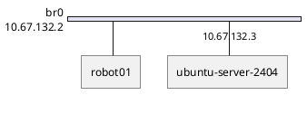

---
# You can also start simply with 'default'
theme: seriph
# random image from a curated Unsplash collection by Anthony
# like them? see https://unsplash.com/collections/94734566/slidev
background: https://cover.sli.dev
# some information about your slides (markdown enabled)
hideInToc: true
title: KVM/QEMU Training
author: Mischa Taylor
info: |
  ## Slidev Starter Template
  Presentation slides for developers.
# apply unocss classes to the current slide
class: text-center
# https://sli.dev/features/drawing
drawings:
  persist: false
# enable MDC Syntax: https://sli.dev/features/mdc
mdc: true
# open graph
# seoMeta:
#  ogImage: https://cover.sli.dev
themeConfig:
  paginationX: r
  paginationY: t
  paginationPagesDisabled: [1]
---

# Virtual Machines with KVM/QEMU

##### Mischa Taylor | 📧 <taylor@linux.com>

<div @click="$slidev.nav.next" class="mt-12 py-1" hover:bg="white op-10">
  Press Space for next page <carbon:arrow-right />
</div>

<div class="abs-br m-6 text-xl">
  <button @click="$slidev.nav.openInEditor()" title="Open in Editor" class="slidev-icon-btn">
    <carbon:edit />
  </button>
  <a href="https://github.com/slidevjs/slidev" target="_blank" class="slidev-icon-btn">
    <carbon:logo-github />
  </a>
</div>

<!--
The last comment block of each slide will be treated as slide notes. It will be visible and editable in Presenter Mode along with the slide. [Read more in the docs](https://sli.dev/guide/syntax.html#notes)
-->

---
hideInToc: true
routeAlias: toc
---

# Table of Contents

<Toc columns="2"/>

---
hideInToc: true
---

# What is KVM?

- KVM - **K**ernel-based **V**irtual **M**achine
- Built-in to the Linux kernel
- Kernel allocates memory for each VM
  - Ensures that each guest has its own memory space
  - Ensures that memory for each virtual machine is isolated from the other guests and the host
- KVM cannot:
  - Create a VM
  - Save a VM
  - Open a VM
  - Provide user-accessible APIs
- Controlled using ioctl calls

---
hideInToc: true
---

# KVM is useless by itself

- QEMU
  - Provides user-space CLI binaries to create and load VMs
  - Emulates different hardware by replicating in software
  - Can use hardware to accelerate virtualization for near-native performance (a.k.a. paravirtualization or virtio)
- Libvirt
  - Daemons that control virtual machine lifecycle
  - Provides standard API for starting, stopping, configuring VMs

---
layout: section
---

# Install and configure libvirt

<br>
<br>
<Link to="toc" title="Table of Contents"/>

---
hideInToc: true
---

# Install QEMU/KVM on Ubuntu 24.04

Install QEMU/KVM and libvirtd

```bash
sudo apt-get update
sudo apt-get install qemu-kvm libvirt-daemon-system
sudo apt-get install virtinst
```

Make sure the current user is a member of the libvirt and kvm groups

```bash
$ sudo adduser $(id -un) libvirt
Adding user '<username>' to group 'libvirt' ...
$ sudo adduser $(id -un) kvm
Adding user '<username>' to group 'kvm' ...
```

Be sure to reboot!!!!

```bash
sudo reboot
```

---
hideInToc: true
---

# Validate config

```bash
$ virt-host-validate qemu
```

X86_64-based machines will likely display a warning about cgroup devices controller support not being enabled. This allows you to apply resource management to virtual machines. For more information refer to this doc. To add cgroup 'devices' controller support, edit /etc/default/grub and change the line that looks like GRUB_CMDLINE_LINUX_DEFAULT="quiet splash" to:

```bash
# GRUB_CMDLINE_LINUX_DEFAULT="quiet splash"
GRUB_CMDLINE_LINUX_DEFAULT="quiet splash intel_iommu=on systemd.unified_cgroup_hierarchy=0"
```

```bash
# amd
GRUB_CMDLINE_LINUX_DEFAULT="quiet splash amd_iommu=on iommu=pt systemd.unified_cgroup_hierarchy=0"
```

```bash
sudo update-grub
```

---
hideInToc: true
---

# Default Network

```bash
$ cat /usr/share/libvirt/networks/default.xml
<network>
  <name>default</name>
  <bridge name='virbr0'/>
  <forward/>
  <ip address='192.168.122.1' netmask='255.255.255.0'>
    <dhcp>
      <range start='192.168.122.2' end='192.168.122.254'/>
    </dhcp>
  </ip>
</network>
```

```bash
$ ip -br a
lo               UNKNOWN        127.0.0.1/8 ::1/128
enp113s0         DOWN
eno1             UP             10.67.132.223/22 metric 100 fe80::a6ae:11ff:fe1e:48fa/64
wlp4s0           DOWN
virbr0           DOWN           192.168.122.1/24
```

```bash
$ virsh net-list --all
 Name      State    Autostart   Persistent
--------------------------------------------
 default   active   yes         yes
```

---
hideInToc: true
---

# Image pool

```bash
$ virsh pool-define-as \
    --name default \
    --type dir \
    --target /var/lib/libvirt/images
$ virsh pool-build default
$ virsh pool-start default
$ virsh pool-autostart default
```

```bash
$ virsh pool-list --all
$ virsh vol-list --pool default --details
```

---
hideInToc: true
---

# cloud-init image pool

Note: There is a `--cloud-init` parameter for virt-install to auto-generate the
cloud-init ISO. However there's currently a bug in virt-install <= 4.1.0 that
makes it usuable. So we manage the lifecycle manually.
https://github.com/virt-manager/virt-manager/issues/178

```bash
$ virsh pool-define-as \
    --name boot-scratch \
    --type dir \
    --target /var/lib/libvirt/boot
$ virsh pool-build boot-scratch
$ virsh pool-start boot-scratch
$ virsh pool-autostart boot-scratch
```

```bash
$ virsh pool-list --all
$ virsh vol-list --pool boot-scratch --details
```

---
hideInToc: true
---

# ISO image pool

```bash
$ virsh pool-define-as \
    --name iso \
    --type dir \
    --target /var/lib/libvirt/iso
$ virsh pool-build iso
$ virsh pool-start iso
$ virsh pool-autostart iso
```

```bash
$ virsh pool-list --all
$ virsh vol-list --pool iso --details
```

---
layout: section
---

# Spin up your first VM

<br>
<br>
<Link to="toc" title="Table of Contents"/>

---
hideInToc: true
---

# Verify host resources

```bash
$ virsh nodeinfo
CPU model:           x86_64
CPU(s):              12
CPU frequency:       3799 MHz
CPU socket(s):       1
Core(s) per socket:  6
Thread(s) per core:  2
NUMA cell(s):        1
Memory size:         65699300 KiB
```

```bash
$ df -h
Filesystem                         Size  Used Avail Use% Mounted on
tmpfs                              6.3G  2.4M  6.3G   1% /run
/dev/mapper/ubuntu--vg-ubuntu--lv  1.8T   16G  1.7T   1% /
tmpfs                               32G     0   32G   0% /dev/shm
tmpfs                              5.0M   12K  5.0M   1% /run/lock
efivarfs                           192K   69K  119K  37% /sys/firmware/efi/efivars
tmpfs                               32G     0   32G   0% /run/qemu
/dev/nvme2n1p2                     2.0G  103M  1.7G   6% /boot
/dev/nvme2n1p1                     1.1G  6.2M  1.1G   1% /boot/efi
```

---
hideInToc: true
---

# Ubuntu cloud images

https://cloud-images.ubuntu.com/

- Fast to spin up and minimal
- Do not come pre-configured with a default login
- Minimal drivers/hardware support out of the box

---
hideInToc: true
---

# Create directory for config files (optional)

```bash
mkdir ubuntu-server-2404
cd ubuntu-server-2404
```

---
hideInToc: true
---

# Download cloud image template and resize

```bash
$ curl -LO \
    https://cloud-images.ubuntu.com/noble/current/noble-server-cloudimg-amd64.img
$ qemu-img info noble-server-cloudimg-amd64.img
```

```bash
$ sudo qemu-img convert \
    -f qcow2 -O qcow2 \
    noble-server-cloudimg-amd64.img \
    /var/lib/libvirt/images/ubuntu-server-2404.qcow2
$ sudo qemu-img resize -f qcow2 \
    /var/lib/libvirt/images/ubuntu-server-2404.qcow2 \
    32G
```

<!--
```
curl -LO \
  https://crake-nexus.org.boxcutter.net/repository/ubuntu-cloud-images-proxy/noble/current/noble-server-cloudimg-amd64.img
```
-->

---
hideInToc: true
---

# Define login parameters for cloud-init ISO

```bash
# Required for NoCloud module to function, uniquely identifies instance
cat >meta-data <<EOF
instance-id: ubuntu-server-2404
local-hostname: ubuntu-server-2404
EOF

# Main configuration script, tells cloud-init what to do when instance starts
cat >user-data <<EOF
#cloud-config
password: superseekret
chpasswd:
  expire: false
ssh_pwauth: true
EOF
```

---
hideInToc: true
---

# Generate cloud-init ISO

```bash
sudo apt-get update
sudo apt-get install genisoimage
```

```bash
$ genisoimage \
    -input-charset utf-8 \
    -output ubuntu-server-2404-cloud-init.img \
    -volid cidata -rational-rock -joliet \
    user-data meta-data

sudo cp ubuntu-server-2404-cloud-init.img \
  /var/lib/libvirt/boot/ubuntu-server-2404-cloud-init.iso
```

Alternative way with cloud-localds:

```bash
sudo apt-get update
sudo apt-get install cloud-image-utils
```

```bash
sudo cloud-localds \
  /var/lib/libvirt/boot/ubuntu-server-2404-cloud-init.iso \
  user-data meta-data \
  --verbose
```

---
hideInToc: true
---

# Spin up image and configure with cloud-init

```bash
virt-install \
  --connect qemu:///system \
  --name ubuntu-server-2404 \
  --boot uefi \
  --memory 2048 \
  --vcpus 2 \
  --os-variant ubuntu24.04 \
  --disk /var/lib/libvirt/images/ubuntu-server-2404.qcow2,bus=virtio \
  --disk /var/lib/libvirt/boot/ubuntu-server-2404-cloud-init.iso,device=cdrom \
  --network network=default,model=virtio \
  --graphics spice \
  --noautoconsole \
  --console pty,target_type=serial \
  --import \
  --debug
```

---
hideInToc: true
---

# Virtual machine console

```bash
# Command line console
virsh console ubuntu-server-2404

# Graphical console
virt-viewer ubuntu-server-2404
```

---
hideInToc: true
---

# Disable cloud-init and remove cloud-init ISO

In the guest:
```bash
# login with ubuntu user
$ cloud-init status
status: done

# Disable cloud-init
$ sudo touch /etc/cloud/cloud-init.disabled

$ sudo apt-get update
$ sudo apt-get install qemu-guest-agent

$ sudo shutdown -h now
```

On the host
```bash
$ virsh domblklist ubuntu-server-2404
$ virsh change-media ubuntu-server-2404 sda --eject
$ sudo rm /var/lib/libvirt/boot/ubuntu-server-2404-cloud-init.iso
```


---
hideInToc: true
---


# Snapshots

```bash
$ virsh snapshot-create-as --domain ubuntu-server-2404 --name clean --description "Initial install"
$ virsh snapshot-list ubuntu-server-2404
$ virsh snapshot-revert ubuntu-server-2404 clean
$ virsh snapshot-delete ubuntu-server-2404 clean
```

# Cleanup

```bash
$ virsh shutdown ubuntu-server-2404
$ virsh undefine ubuntu-server-2404 --nvram --remove-all-storage
```

---
hideInToc: true
---

# Get IP of virtual machine

Preferred - use qemu-guest-agent

```bash
virsh start ubuntu-server-2404

virsh list --all
```

```
$ virsh domifaddr ubuntu-server-2404 --source agent
```

When using default NAT-based networking, can query dnsmasq

```
virsh net-dhcp-leases default
```

```bash
virsh domiflist ubuntu-server-2404
sudo apt-get install net-tools
arp -an
```

---
hideInToc: true
---

# If you need additional drivers

```bash
# First try to install the kernel modules package
sudo apt-get update
sudo apt-get install linux-modules-$(uname -r)

# sudo modprobe <kernel_module>

# If that still doesn't work, try installing the full generic kernel image
sudo apt-get install linux-image-generic
# linux-generic-hwe-24.04
sudo reboot
```

---
hideInToc: true
---

# Resource allocation

- Reserving a core for the host is a good idea
- Resource starvation can make a host inaccessible remotely
- Memory can be overcommitted
- Measure peak memory usage in each VM and add an overhead of 20% for host to manage guest

---
hideInToc: true
---

# Change number of CPUs

Change the CPUs offline
```bash
# Shutdown the VM
virsh shutdown <vm-name>
# Wait until vm is shut off
virsh list --all

# Edit the VM definition
virsh edit <vm name>
# Look for the <vcpu> tag and update the count
# You can also add a <cpu> block to define topology, features or NUMA if needed
<vcpu placement='static'>4</vcpu>

# Start the VM
virsh start <vm-name>
```

---
hideInToc: true
---

# Verify CPU settings

On host:
```bash
virsh dominfo <vm-name>
```

In guest:
```bash
# Print number of vCPUS
nproc
# More detail
lscpu
# Count cpu entries in /proc/cpuinfo
grep -c ^processor /proc/cpuinfo
```

---
hideInToc: true
---

# Changing memory

Change the memory offline

```bash
# Shutdown the VM
virsh shutdown <vm-name>
# Wait until vm is shut off
virsh list --all

# Edit the VM definition
virsh edit <vm name>
# Locate and update the <memory> and <currentMemory> elements (values in KiB):
# currentMemory - how much memory is used at boot
# memory - how much memory that can be hotplugged later if greater
# Normally you'll just make these two fields the same
<memory unit='KiB'>4194304</memory>         <!-- Max memory (e.g., 4 GiB) -->
<currentMemory unit='KiB'>2097152</currentMemory> <!-- Initial memory -->

# Start the VM
virsh start <vm-name>

# Verify settings:
virsh dominfo <vm-name>
```

---
hideInToc: true
---

# QCOW2

qcow2 stands for **QEMU Copy On Write version 2**, and it’s a disk image format used by QEMU/KVM virtual machines. It’s designed to be more flexible and efficient than raw disk images (.img, .raw).

---
hideInToc: true
---

# 🔍 Key Features of qcow2

| Feature             | Description |
| ------------------- | ----------- |
| Copy-on-write (COW) | Only changes from the base image are stored. Great for snapshots and templates. |
| Smaller size        | Sparse files — actual disk usage grows only as data is written. |
| Compression         | Supports zlib-based compression for smaller image size. |
| Snapshots           | Supports internal snapshots for point-in-time rollback. |
| Backing files       | Can base one image on another (ideal for golden images/templates). |

---
hideInToc: true
---

# 🧠 How it works

- A qcow2 image starts small.
- When the VM writes data, the image grows dynamically.
- You can layer qcow2 files by using a backing file, allowing multiple VMs to share a base OS image and store only their deltas.

Example:

```bash
qemu-img create -f qcow2 -b ubuntu-base.qcow2 vm1.qcow2
```

---
hideInToc: true
---

# ⚙️  Tools to work with qcow2

Inspect

```bash
qemu-img info disk.qcow2
```

Create

```bash
qemu-img create -f qcow2 disk.qcow2 20G
```

Convert from raw

```bash
qemu-img convert -f raw -O qcow2 disk.raw disk.qcow2
```

---
hideInToc: true
---

# Compacting qcow2 image files

Within the guest - zerofill the data on disk:
```
root@guest # sfill -fllvz
```

Then clone the image file:

```
qemu-img convert -p -O qcow2 ./source.img ./packed.img
```

---
hideInToc: true
---

# Mounting cloud images outside of a VM

There are multiple ways to mount image files:

- virt-customize
   - Provides simple image customization options through CLI parameters
   - Not as useful as one would hope because network won't be configured propery   - No default users are on cloud images
- If image is raw, you can just mount the image file
- mount+nbd
  - really fast
  - requires root
  - cannot mount read-only
- guestfish
  - does not need root
  - more complicated to use
  - more safe, can mount read-only

---
hideInToc: true
---

# virt-customize

```bash
sudo apt-get update
sudo apt-get install libguestfs-tools
```

```bash
$ curl -LO \
    https://cloud-images.ubuntu.com/noble/current/noble-server-cloudimg-amd64.img
$ qemu-img info noble-server-cloudimg-amd64.img
```

```bash
$ sudo virt-customize \
    -a noble-server-cloudimg-amd64.img \
    --root-password password:superseekret \
    --hostname noble-vm \
    --run-command 'useradd -m -s /bin/bash automat' \
    --password automat:password:superseekret \
    --run-command 'usermod -aG sudo automat'
[   0.0] Examining the guest ...
[  14.1] Setting a random seed
virt-customize: warning: random seed could not be set for this type of
guest
[  14.1] Setting the machine ID in /etc/machine-id
[  14.1] Setting passwords
[  15.0] SELinux relabelling
[  15.2] Finishing off
```

---
hideInToc: true
---

```bash
$ sudo qemu-img convert \
    -f qcow2 -O qcow2 \
    noble-server-cloudimg-amd64.img \
    /var/lib/libvirt/images/noble-vm.qcow2
$ sudo qemu-img resize -f qcow2 \
    /var/lib/libvirt/images/noble-vm.qcow2 \
    32G
```

```bash
virt-install \
  --connect qemu:///system \
  --name noble-vm \
  --boot uefi \
  --memory 2048 \
  --vcpus 2 \
  --os-variant ubuntu24.04 \
  --disk /var/lib/libvirt/images/noble-vm.qcow2,bus=virtio \
  --network network=default,model=virtio \
  --graphics spice \
  --noautoconsole \
  --console pty,target_type=serial \
  --import \
  --debug

```

---
hideInToc: true
---

```bash
# login with root
virsh console noble-vm
```

---
hideInToc: true
---

# Mount cloud image without any special tooling

Install prerequisites:
```bash
sudo apt update
sudo apt install qemu-utils
```

If the image is in qcow2 format, convert it to raw:
```bash
$ qemu-img convert -f qcow2 -O raw \
    noble-server-cloudimg-amd64.img \
    noble-server-cloudimg-amd64.raw
```

---
hideInToc: true
---

Find the offset of where the partition starts:

```bash
$ fdisk -l noble-server-cloudimg-amd64.raw
Disk noble-server-cloudimg-amd64.raw: 3.5 GiB, 3758096384 bytes, 7340032 sectors
Units: sectors of 1 * 512 = 512 bytes
Sector size (logical/physical): 512 bytes / 512 bytes
I/O size (minimum/optimal): 512 bytes / 512 bytes
Disklabel type: gpt
Disk identifier: 911538A2-3427-4DA6-8050-A7A81B41F049

Device                              Start     End Sectors  Size Type
noble-server-cloudimg-amd64.raw1  2099200 7339998 5240799  2.5G Linux filesystem
noble-server-cloudimg-amd64.raw14    2048   10239    8192    4M BIOS boot
noble-server-cloudimg-amd64.raw15   10240  227327  217088  106M EFI System
noble-server-cloudimg-amd64.raw16  227328 2097152 1869825  913M Linux extended b

Partition table entries are not in disk order.

# Offset is the second number times the sector size (usually 512 bytes)
$ echo $((227328 * 512))
116391936
```

---
hideInToc: true
---

```bash
# Mount the image
sudo mkdir /mnt/my_image
sudo mount -o loop,offset=116391936 \
  noble-server-cloudimg-amd64.raw /mnt/my_image

# Image contents are available as /mnt/my_image

# Unmount the iamge
sudo umount /mnt/my_image
rmdir /mnt/my_image
```

---
hideInToc: true
---

# Mount cloud image with qemu-nbd - prerequisites

```bash
# nbd module not loaded by default

# Load the nbd module
sudo modprobe nbd
# Verify the nbd module is loaded
 lsmod | grep nbd
nbd                    65536  0
# Should see nbd devices
$ ls /dev/nbd*
/dev/nbd0   /dev/nbd11  /dev/nbd14  /dev/nbd3  /dev/nbd6  /dev/nbd9
/dev/nbd1   /dev/nbd12  /dev/nbd15  /dev/nbd4  /dev/nbd7
/dev/nbd10  /dev/nbd13  /dev/nbd2   /dev/nbd5  /dev/nbd8
```

---
hideInToc: true
---

# Mount cloud image with qemu-nbd

```bash
# Connect the QCOW2 image as a network block device
sudo qemu-nbd --connect=/dev/nbd0 noble-server-cloudimg-amd64.img

# List partitions
$ sudo fdisk -l /dev/nbd0
Disk /dev/nbd0: 3.5 GiB, 3758096384 bytes, 7340032 sectors
Units: sectors of 1 * 512 = 512 bytes
Sector size (logical/physical): 512 bytes / 512 bytes
I/O size (minimum/optimal): 512 bytes / 131072 bytes
Disklabel type: gpt
Disk identifier: 911538A2-3427-4DA6-8050-A7A81B41F049

Device         Start     End Sectors  Size Type
/dev/nbd0p1  2099200 7339998 5240799  2.5G Linux filesystem
/dev/nbd0p14    2048   10239    8192    4M BIOS boot
/dev/nbd0p15   10240  227327  217088  106M EFI System
/dev/nbd0p16  227328 2097152 1869825  913M Linux extended boot

Partition table entries are not in disk order
```

---
hideInToc: true
---

# Mount cloud image with qemu-nbd

```bash
# Create a mount point directory
sudo mkdir /mnt/my_image
sudo mount /dev/nbd0p1 /mnt/my_image

$ ls /mnt/my_image
bin                etc    lib.usr-is-merged  opt   sbin                sys
bin.usr-is-merged  home   lost+found         proc  sbin.usr-is-merged  tmp
boot               lib    media              root  snap                usr
dev                lib64  mnt                run   srv                 var

# Use chroot jail to execute commands inside of the mounted root filesystem
$ sudo chroot /mnt/my_image

root@robot00:/# ls
bin                etc    lib.usr-is-merged  opt   sbin                sys
bin.usr-is-merged  home   lost+found         proc  sbin.usr-is-merged  tmp
boot               lib    media              root  snap                usr
dev                lib64  mnt                run   srv                 var

root@robot00:/# exit
exit
```

---
hideInToc: true
---

# nbd cleanup

```bash
# Check for active nbd entries
$ lsblk | grep '^nbd'

# Unmount the image file
$ sudo umount /mnt/my_image
$ sudo qemu-nbd --disconnect /dev/nbd0
```

---
hideInToc: true
---

# Mount cloud image with guestfish - prerequisites

```bash
sudo apt-get update
sudo apt-get install libguestfs-tools
```

---
layout: section
---

# Networking modes

<br>
<br>
<Link to="toc" title="Table of Contents"/>

---
hideInToc: true
---

# Networking modes

Libvirt requires configuration of virtual network switches, also known as
"bridges" to support different network operating modes
- https://wiki.libvirt.org/VirtualNetworking.html
- https://developers.redhat.com/blog/2018/10/22/introduction-to-linux-interfaces-for-virtual-networking#
- https://docs.kernel.org/networking/switchdev.html

In the default NAT mode, computers external to the host can't communicate
with guest virtual machines. Guests can communicate with the outside
world, however, similar to how home internet connections work behind a
NAT gateway.

---
hideInToc: true
---

# What VirtualBox does that KVM doesn't

1. VirtualBox Runs as a privileged daemon

   - VirtualBox networking (including bridging is managed by the
     VBoxNetAdp/VBoxNetFlt kernel modules that run with elevated privileges.

   - These components hook into the host NIC at a lower level (via a
     proprietary filter driver).

   - This lets VirtualBox inject packets into the host NIC as if they came
     directly from the guest - without needing the host to have any special
     preconfigure bridge.

2. No Need for Pre-Existing Linux bridges

---

# macvtap

Create XML definition

```bash
cat <<EOF > /tmp/macvtap-network.xml
<network>
  <name>macvtap-network</name>
  <forward mode="bridge">
    <interface dev="eno1"/>
  </forward>
</network>
EOF
```

Configure

```bash
$ virsh net-define /tmp/macvtap-network.xml
$ virsh net-start macvtap-network
$ virsh net-autostart macvtap-network
```

Destroy

```bash
virsh net-destroy macvtap-network
virsh net-undefine macvtap-network
```

---
hideInToc: true
---

Verify
```bash
$ virsh net-list
 Name              State    Autostart   Persistent
----------------------------------------------------
 default           active   yes         yes
 macvtap-network   active   yes         yes
```

---
hideInToc: true
---

# Download cloud image template and resize

```bash
curl -LO https://cloud-images.ubuntu.com/noble/current/noble-server-cloudimg-amd64.img
```

```bash
$ qemu-img info noble-server-cloudimg-amd64.img
$ sudo qemu-img convert \
    -f qcow2 -O qcow2 \
    noble-server-cloudimg-amd64.img \
    /var/lib/libvirt/images/ubuntu-server-2404.qcow2
$ sudo qemu-img resize -f qcow2 \
    /var/lib/libvirt/images/ubuntu-server-2404.qcow2 \
    32G
```

<!--
```
curl -LO \
  https://crake-nexus.org.boxcutter.net/repository/ubuntu-cloud-images-proxy/noble/current/noble-server-cloudimg-amd64.img
```
-->

---

```bash
# Required for NoCloud module to function, uniquely identifies instance
cat >meta-data <<EOF
instance-id: ubuntu-server-2404
local-hostname: ubuntu-server-2404
EOF
```

---

```bash
# Main configuration script, tells cloud-init what to do when instance starts
cat >user-data <<EOF
#cloud-config
hostname: ubuntu-server-2404
users:
  - name: automat
    uid: 63112
    primary_group: users
    groups: users
    shell: /bin/bash
    plain_text_passwd: superseekret
    sudo: ALL=(ALL) NOPASSWD:ALL
    lock_passwd: false
chpasswd: { expire: False }
ssh_pwauth: True
package_update: False
package_upgrade: false
packages:
  - qemu-guest-agent
growpart:
  mode: auto
  devices: ['/']
power_state:
  mode: reboot
EOF
```

---
hideInToc: true
---

```bash
sudo apt-get update
sudo apt-get install genisoimage
```

```bash
$ genisoimage \
    -input-charset utf-8 \
    -output ubuntu-server-2404-cloud-init.img \
    -volid cidata -rational-rock -joliet \
    user-data meta-data network-config

sudo cp ubuntu-server-2404-cloud-init.img \
  /var/lib/libvirt/boot/ubuntu-server-2404-cloud-init.iso
```

---
hideInToc: true
---

```bash
virt-install \
  --connect qemu:///system \
  --name ubuntu-server-2404 \
  --boot uefi \
  --memory 2048 \
  --vcpus 2 \
  --os-variant ubuntu24.04 \
  --disk /var/lib/libvirt/images/ubuntu-server-2404.qcow2,bus=virtio \
  --disk /var/lib/libvirt/boot/ubuntu-server-2404-cloud-init.iso,device=cdrom \
  --network network=macvtap-network,model=virtio \
  --graphics spice \
  --noautoconsole \
  --console pty,target_type=serial \
  --import \
  --debug
```

---
hideInToc: true
---

```bash
sudo ip link add link eno1 name macvtap0 type macvtap mode bridge
sudo ip link set macvtap0 up
```

🧠 macvtap0 acts like a NIC plugged into the LAN; eth0 must not be enslaved to a bridge.

- /dev/tapX (e.g., /dev/tap0)
- Associated macvtap0 interface bound to eth0

```
sudo ip link delete macvtap0
```

---
hideInToc: true
---

```bash
virt-install \
  --connect qemu:///system \
  --name ubuntu-server-2404 \
  --boot uefi \
  --memory 2048 \
  --vcpus 2 \
  --os-variant ubuntu24.04 \
  --disk /var/lib/libvirt/images/ubuntu-server-2404.qcow2,bus=virtio \
  --disk /var/lib/libvirt/boot/ubuntu-server-2404-cloud-init.iso,device=cdrom \
  --network type=direct,source=eno1,source_mode=bridge,model=virtio \
  --graphics spice \
  --noautoconsole \
  --console pty,target_type=serial \
  --import \
  --debug
```

---

# br0 - Bridged Networking



---
hideInToc: true
---

# Determine networking type

- NetworkManager - normally used on Ubuntu Desktop
- systemd-networkd - normally used on Ubuntu Server

---

NetworkManager check:
```bash
$ nmcli general
STATE      CONNECTIVITY  WIFI-HW  WIFI     WWAN-HW  WWAN    
connected  full          enabled  enabled  enabled  enabled

$ nmcli connection
NAME                UUID                                  TYPE      DEVICE  
Wired connection 1  5297a82f-7244-31f3-9dad-c3fb49be0b33  ethernet  eno1    
docker0             80651a82-b1af-4ed7-a4bb-e0a802d6f012  bridge    docker0 
virbr0              d0da1989-df49-44dc-9c48-aa3c978fbb90  bridge    virbr0

$ networkctl
WARNING: systemd-networkd is not running, output will be incomplete.

IDX LINK      TYPE     OPERATIONAL SETUP    
  1 lo        loopback n/a         unmanaged
  2 eno1      ether    n/a         unmanaged
  3 wlp0s20f3 wlan     n/a         unmanaged
  4 virbr0    bridge   n/a         unmanaged
  5 docker0   bridge   n/a         unmanaged

5 links listed.
```

---
hideInToc: true
---
systemd-networkd check
```bash
$ networkctl
IDX LINK  TYPE     OPERATIONAL SETUP
  1 lo    loopback carrier     unmanaged
  2 ens33 ether    routable    configured

2 links listed.
```


---
hideInToc: true
---

# Configure bridged networking with NetworkManager (1 of 2)

```bash
$ ip -brief link
lo               UNKNOWN        00:00:00:00:00:00 <LOOPBACK,UP,LOWER_UP> 
ens33            UP             00:0c:29:25:7e:47 <BROADCAST,MULTICAST,UP,LOWER_UP>

$ nmcli connection show --active
NAME                UUID                                  TYPE      DEVICE 
Wired connection 1  779e47c2-776a-3c0a-a498-ebffcbe374c4  ethernet  ens33
```

```bash
$ ls /etc/netplan
01-network-manager-all.yaml
$ cat /etc/netplan/01-network-manager-all.yaml 
# Let NetworkManager manage all devices on this system
network:
  version: 2
  renderer: NetworkManager
```

---
hideInToc: true
---

# Configure bridged networking with NetworkManager (2 of 2)

```bash
# This is the network config written by 'subiquity'
network:
  version: 2
  renderer: NetworkManager
  ethernets:
    ens33:
      dhcp4: false
      dhcp6: false
      optional: true
  bridges:
    br0:
      dhcp4: true
      dhcp6: false
      accept-ra: false
      link-local: []
      interfaces:
        - ens33
```

```
$ sudo netplan try
$ sudo netplan apply
```

---
hideInToc: true
---

# systemd-networkd -  Configure bridged networking (1 of 3)

```bash
$ ip -brief link
lo               UNKNOWN        00:00:00:00:00:00 <LOOPBACK,UP,LOWER_UP>
ens33            UP             00:0c:29:b6:83:61 <BROADCAST,MULTICAST,UP,LOWER_UP>
```

```bash
$ ls /etc/netplan
00-installer-config.yaml
$ cat /etc/netplan/00-installer-config.yaml
# This is the network config written by 'subiquity'
network:
  ethernets:
    ens33:
      dhcp4: true
  version: 2
```

---
hideInToc: true
---

# systemd-networkd - Configure bridged networking (2 of 3)

```bash
# This is the network config written by 'subiquity'
network:
  version: 2
  renderer: networkd
  ethernets:
    ens33:
      dhcp4: false
      dhcp6: false
      optional: true
  bridges:
    br0:
      dhcp4: true
      dhcp6: false
      accept-ra: false
      link-local: []
      interfaces:
        - ens33
```

---
hideInToc: true
---

# systemd-networkd - Configure bridged networking (3 of 3)

```
$ sudo netplan try
$ sudo netplan apply
```

```bash
$ networkctl
IDX LINK  TYPE     OPERATIONAL SETUP
  1 lo    loopback carrier     unmanaged
  2 ens33 ether    enslaved    configured
  3 br0   bridge   routable    configured

3 links listed.

$ ip -brief addr
lo               UNKNOWN        127.0.0.1/8 ::1/128
ens33            UP
br0              UP             172.25.0.112/22 metric 100 fe80::f4d4:91ff:feed:5e12/64
```

---
hideInToc: true
---

# Create a definition for the host network (1 of 2)

Create XML definition

```bash
cat <<EOF > /tmp/host-network.xml
<network>
  <name>host-network</name>
  <forward mode="bridge"/>
  <bridge name="br0" />
</network>
EOF
```

Configure

```bash
$ sudo virsh net-define /tmp/host-network.xml
$ sudo virsh net-start host-network
$ sudo virsh net-autostart host-network
```

---
hideInToc: true
---

# Create a definition for the host network (2 of 2)

Verify

```bash
$ virsh net-list --all
 Name           State    Autostart   Persistent
-------------------------------------------------
 default        active   yes         yes
 host-network   active   yes         yes
```

---
hideInToc: true
---

# Download cloud image template and resize

```bash
curl -LO https://cloud-images.ubuntu.com/noble/current/noble-server-cloudimg-amd64.img
```

```bash
$ qemu-img info noble-server-cloudimg-amd64.img
$ sudo qemu-img convert \
    -f qcow2 -O qcow2 \
    noble-server-cloudimg-amd64.img \
    /var/lib/libvirt/images/ubuntu-server-2404.qcow2
$ sudo qemu-img resize -f qcow2 \
    /var/lib/libvirt/images/ubuntu-server-2404.qcow2 \
    32G
```

---
hideInToc: true
---

# Define login parameters for cloud-init ISO (1 of 2)

```bash
touch network-config

cat >meta-data <<EOF
instance-id: ubuntu-server-2404
local-hostname: ubuntu-server-2404
EOF
```

---
hideInToc: true
---

# Define login parameters for cloud-init ISO (2 of 2)

```bash
cat >user-data <<EOF
#cloud-config
hostname: ubuntu-server-2404
users:
  - name: automat
    uid: 63112
    primary_group: users
    groups: users
    shell: /bin/bash
    plain_text_passwd: superseekret
    sudo: ALL=(ALL) NOPASSWD:ALL
    lock_passwd: false
chpasswd: { expire: False }
ssh_pwauth: True
package_update: False
package_upgrade: false
packages:
  - qemu-guest-agent
growpart:
  mode: auto
  devices: ['/']
power_state:
  mode: reboot
EOF
```

---
hideInToc: true
---

# Generate cloud-init ISO

```bash
sudo apt-get update
sudo apt-get install genisoimage
```

```bash
$ genisoimage \
    -input-charset utf-8 \
    -output ubuntu-server-2404-cloud-init.img \
    -volid cidata -rational-rock -joliet \
    user-data meta-data network-config

sudo cp ubuntu-server-2404-cloud-init.img \
  /var/lib/libvirt/boot/ubuntu-server-2404-cloud-init.iso
```

---
hideInToc: true
---

# Spin up image and configure with cloud-init (on host-network)

```bash
virt-install \
  --connect qemu:///system \
  --name ubuntu-server-2404 \
  --boot uefi \
  --memory 2048 \
  --vcpus 2 \
  --os-variant ubuntu24.04 \
  --disk /var/lib/libvirt/images/ubuntu-server-2404.qcow2,bus=virtio \
  --disk /var/lib/libvirt/boot/ubuntu-server-2404-cloud-init.iso,device=cdrom \
  --network network=host-network,model=virtio \
  --graphics spice \
  --noautoconsole \
  --console pty,target_type=serial \
  --import \
  --debug
```

---
hideInToc: true
---

# Accessing image

```bash
virsh console ubuntu-server-2404
```

```bash
virt-viewer ubuntu-server-2404
```

---
hideInToc: true
---

# Disable cloud-init and remove cloud-init ISO

```bash
# login with ubuntu user
$ cloud-init status
status: done

# Disable cloud-init
$ sudo touch /etc/cloud/cloud-init.disabled

$ sudo apt-get update
$ sudo apt-get install qemu-guest-agent

$ sudo shutdown -h now
```

```bash
$ virsh domblklist ubuntu-server-2404
$ virsh change-media ubuntu-server-2404 sda --eject
$ sudo rm /var/lib/libvirt/boot/ubuntu-server-2404-cloud-init.iso
```

---
hideInToc: true
---

# Troubleshooting issues with cloud-init

```bash
# Main output log
sudo cat /var/log/cloud-init-output.log

# System-wide cloud-init log
sudo cat /var/log/cloud-init.log

sudo cloud-init schema --system

cloud-init status --long

sudo cloud-init clean
sudo cloud-init init
sudo cloud-init modules --mode=config
sudo cloud-init modules --mode=final
```

---
hideInToc: true
---

# Snapshots

```bash
$ virsh snapshot-create-as --domain ubuntu-server-2404 --name clean --description "Initial install"
$ virsh snapshot-list ubuntu-server-2404
$ virsh snapshot-revert ubuntu-server-2404 clean
$ virsh snapshot-delete ubuntu-server-2404 clean
```

```bash
$ virsh shutdown ubuntu-server-2404
$ virsh undefine ubuntu-server-2404 --nvram --remove-all-storage
```

---
hideInToc: true
---

# Get IP of virtual machine (bridged networking)

```bash
virsh start ubuntu-server-2404

virsh list --all
```

```
virsh domifaddr ubuntu-server-2404 --source agent
```

```
# Does not work (only for NAT networking)
virsh net-dhcp-leases default
```

```
# Also does not work (only for NAT networking)
virsh domiflist ubuntu-server-2404
sudo apt-get install net-tools
arp -an
```

---
hideInToc: true
---

# If you need additional drivers

```
# First try to install the kernel modules package
sudo apt-get update
sudo apt-get install linux-modules-$(uname -r)

# sudo modprobe <kernel_module>

# If that still doesn't work, try installing the full generic kernel image
sudo apt-get install linux-image-generic
# linux-generic-hwe-24.04
sudo reboot
```

---
hideInToc: true
---

# Centos Stream 9

```bash
$ curl -LO https://cloud.centos.org/centos/9-stream/x86_64/images/CentOS-Stream-GenericCloud-x86_64-9-latest.x86_64.qcow2.SHA256SUM
$ curl -LO https://cloud.centos.org/centos/9-stream/x86_64/images/CentOS-Stream-GenericCloud-x86_64-9-latest.x86_64.qcow2
```

```bash
$ qemu-img info CentOS-Stream-GenericCloud-x86_64-9-latest.x86_64.qcow2

$ sudo qemu-img convert \
    -f qcow2 \
    -O qcow2 \
    CentOS-Stream-GenericCloud-x86_64-9-latest.x86_64.qcow2 \
    /var/lib/libvirt/images/centos-stream-9.qcow2
$ sudo qemu-img resize \
    -f qcow2 \
    /var/lib/libvirt/images/centos-stream-9.qcow2 \
    32G
```

---
hideInToc: true
---

```bash
cat >meta-data <<EOF
instance-id: centos-stream-9
local-hostname: centos-stream-9
EOF
```

---
hideInToc: true
---

```bash
cat >user-data <<EOF
#cloud-config
hostname: centos-stream-9
users:
  - name: automat
    uid: 63112
    primary_group: users
    groups: users
    shell: /bin/bash
    plain_text_passwd: superseekret
    sudo: ALL=(ALL) NOPASSWD:ALL
    lock_passwd: false
chpasswd: { expire: False }
ssh_pwauth: True
package_update: False
package_upgrade: false
packages:
  - qemu-guest-agent
growpart:
  mode: auto
  devices: ['/']
power_state:
  mode: reboot
EOF
```

---
hideInToc: true
---

```bash
sudo apt-get update
sudo apt-get install genisoimage
```

```bash
genisoimage \
    -input-charset utf-8 \
    -output centos-stream-9-cloud-init.img \
    -volid cidata -rational-rock -joliet \
    user-data meta-data
sudo cp centos-stream-9-cloud-init.img \
  /var/lib/libvirt/boot/centos-stream-9-cloud-init.iso
```

---
hideInToc: true
---

```bash
virt-install \
  --connect qemu:///system \
  --name centos-stream-9 \
  --boot uefi \
  --memory 2048 \
  --vcpus 2 \
  --os-variant centos-stream9 \
  --disk /var/lib/libvirt/images/centos-stream-9.qcow2,bus=virtio \
  --disk /var/lib/libvirt/boot/centos-stream-9-cloud-init.iso,device=cdrom \
  --network network=host-network,model=virtio \
  --graphics spice \
  --noautoconsole \
  --console pty,target_type=serial \
  --import \
  --debug
```

---
hideInToc: true
---

# Centos Stream 10

```bash
$ curl -LO https://cloud.centos.org/centos/10-stream/x86_64/images/CentOS-Stream-GenericCloud-x86_64-10-latest.x86_64.qcow2.SHA256SUM
$ curl -LO https://cloud.centos.org/centos/10-stream/x86_64/images/CentOS-Stream-GenericCloud-x86_64-10-latest.x86_64.qcow2
```

```bash
$ qemu-img info CentOS-Stream-GenericCloud-x86_64-10-latest.x86_64.qcow2

$ sudo qemu-img convert \
    -f qcow2 \
    -O qcow2 \
    CentOS-Stream-GenericCloud-x86_64-10-latest.x86_64.qcow2 \
    /var/lib/libvirt/images/centos-stream-10.qcow2
$ sudo qemu-img resize \
    -f qcow2 \
    /var/lib/libvirt/images/centos-stream-10.qcow2 \
    32G
```

---
hideInToc: true
---

```bash
cat >meta-data <<EOF
instance-id: centos-stream-10
local-hostname: centos-stream-10
EOF
```

---
hideInToc: true
---

```bash
cat >user-data <<EOF
#cloud-config
hostname: centos-stream-10
users:
  - name: automat
    uid: 63112
    primary_group: users
    groups: users
    shell: /bin/bash
    plain_text_passwd: superseekret
    sudo: ALL=(ALL) NOPASSWD:ALL
    lock_passwd: false
chpasswd: { expire: False }
ssh_pwauth: True
package_update: False
package_upgrade: false
packages:
  - qemu-guest-agent
growpart:
  mode: auto
  devices: ['/']
power_state:
  mode: reboot
EOF
```

---
hideInToc: true
---

```bash
sudo apt-get update
sudo apt-get install genisoimage
```

```bash
$ genisoimage \
    -input-charset utf-8 \
    -output centos-stream-10-cloud-init.img \
    -volid cidata -rational-rock -joliet \
    user-data meta-data

sudo cp centos-stream-10-cloud-init.img \
  /var/lib/libvirt/boot/centos-stream-10-cloud-init.iso
```

---
hideInToc: true
---

```bash
virt-install \
  --connect qemu:///system \
  --name centos-stream-10 \
  --boot uefi \
  --memory 2048 \
  --vcpus 2 \
  --os-variant centos-stream10 \
  --disk /var/lib/libvirt/images/centos-stream-10.qcow2,bus=virtio \
  --disk /var/lib/libvirt/boot/centos-stream-10-cloud-init.iso,device=cdrom \
  --network network=host-network,model=virtio \
  --graphics spice \
  --noautoconsole \
  --console pty,target_type=serial \
  --import \
  --debug
```

---

# Ubuntu autoinstall

Ubuntu Automatic installation lets you answer all configuration questions
ahead of time with an autoinstall configuration allowing an Ubuntu install
to run without any interaction.

Primarily used to automate OS installs on physical machines (a.k.a. metal).

https://canonical-subiquity.readthedocs-hosted.com/en/latest/intro-to-autoinstall.html

- Script Ubuntu manual install with pre-configured answers
- Big install payload, slow to install
- Works on metal
- Complete driver set

---
hideInToc: true
---

# Autoinstall YAML

Autoinstall configuration is provided via an `autoinstall.yaml` file in
the following form:

```yaml
#cloud-config
autoinstall:
    version: 1
    ....
```

The `autoinstall.yaml` file can be provided on the installation ISO itself
or downloaded over the network.

A good starting point is to use the output of the Ubuntu installer from a
manual install. Every time the Ubuntu installer is used, even in manual
mode, it generates an autoinstall for repeating the installation in
`/var/log/installer/autoinstall-user-data`.

---
hideInToc: true
---

# Helpful tools for creating bootable USB sticks from ISO

- Ventoy: https://www.ventoy.net/en/index.html
- Balena Etcher: https://etcher.balena.io/

---
hideInToc: true
---

# Create ISO pool


```bash
virsh pool-define-as iso dir --target "/var/lib/libvirt/iso"
virsh pool-build iso
virsh pool-start iso
virsh pool-autostart iso
```

---
hideInToc: true
---

# Docker install

```bash
# Add Docker's official GPG key:
sudo apt-get update
sudo apt-get install ca-certificates curl
sudo install -m 0755 -d /etc/apt/keyrings
sudo curl -fsSL https://download.docker.com/linux/ubuntu/gpg -o /etc/apt/keyrings/docker.asc
sudo chmod a+r /etc/apt/keyrings/docker.asc

# Add the repository to Apt sources:
echo \
  "deb [arch=$(dpkg --print-architecture) signed-by=/etc/apt/keyrings/docker.asc] https://download.docker.com/linux/ubuntu \
  $(. /etc/os-release && echo "${UBUNTU_CODENAME:-$VERSION_CODENAME}") stable" | \
  sudo tee /etc/apt/sources.list.d/docker.list > /dev/null
sudo apt-get update

sudo apt-get install docker-ce docker-ce-cli containerd.io docker-buildx-plugin docker-compose-plugin

sudo groupadd docker
sudo usermod -aG docker $USER
newgrp docker

# Verify
docker run hello-world
```

---

# Ubuntu Server 24.04 autoinstall - prepare ISO

```bash
mkdir -p ~/github/boxcutter && cd ~/github/boxcutter
git clone https://github.com/boxcutter/kvm
cd ~/github/boxcutter/kvm/autoinstall/generic/kvm/ubuntu-server-2404

$ curl -LO https://releases.ubuntu.com/noble/ubuntu-24.04.3-live-server-amd64.iso
$ shasum -a 256 ubuntu-24.04.3-live-server-amd64.iso
c3514bf0056180d09376462a7a1b4f213c1d6e8ea67fae5c25099c6fd3d8274b  ubuntu-24.04.3-live-server-amd64.iso

docker pull docker.io/boxcutter/ubuntu-autoinstall
docker run -it --rm \
  --mount type=bind,source="$(pwd)",target=/data \
  docker.io/boxcutter/ubuntu-autoinstall \
    -a autoinstall.yaml \
    -g grub.cfg \
    -i \
    -s ubuntu-24.04.3-live-server-amd64.iso \
    -d ubuntu-24.04.3-live-server-amd64-autoinstall.iso
```

<!--
```
curl -LO \
  https://crake-nexus.org.boxcutter.net/repository/ubuntu-releases-proxy/noble/ubuntu-24.04.3-live-server-amd64.iso
```
-->

---

# Ubuntu Server 24.04 autoinstall - test autoinstall in a VM

```bash
sudo cp ubuntu-24.04.3-live-server-amd64.iso \
  /var/lib/libvirt/iso/ubuntu-server-2404-autoinstall.iso

virsh vol-create-as default ubuntu-server-2404.qcow2 50G --format qcow2
# virsh vol-delete --pool default ubuntu-server-2404.qcow2

virt-install \
  --connect qemu:///system \
  --name ubuntu-server-2404 \
  --boot uefi \
  --cdrom /var/lib/libvirt/iso/ubuntu-server-2404-autoinstall.iso \
  --memory 2048 \
  --vcpus 2 \
  --os-variant ubuntu24.04 \
  --disk vol=default/ubuntu-server-2404.qcow2,bus=virtio \
  --network network=host-network,model=virtio \
  --graphics spice \
  --noautoconsole \
  --console pty,target_type=serial \
  --debug

# To watch the install. Once it completes it will stop the vm:
$ virsh console ubuntu-server-2404
$ virsh-viewer ubuntu-server-2404
```

---
hideInToc: true
---

# If you need additional drivers

```bash
# First try to install the kernel modules package
sudo apt-get update
sudo apt-get install linux-modules-$(uname -r)

# sudo modprobe <kernel_module>

# If that still doesn't work, try installing the full generic kernel image
sudo apt-get install linux-image-generic
# linux-generic-hwe-24.04
# sudo apt install linux-lowlatency
sudo reboot
```

---
hideInToc: true
---

# Ubuntu 24.04 Desktop manual install

```bash
curl -LO https://releases.ubuntu.com/24.04.2/ubuntu-24.04.2-desktop-amd64.iso
# curl -LO https://https://crake-nexus.org.boxcutter.net//repository/ubuntu-releases-proxy/24.04.2/ubuntu-24.04.2-desktop-amd64.iso
% shasum -a 256 ubuntu-24.04.2-desktop-amd64.iso
d7fe3d6a0419667d2f8eff12796996328daa2d4f90cd9f87aa9371b362f987bf  ubuntu-24.04.2-desktop-amd64.iso
```

---
hideInToc: true
---

```bash
sudo cp ubuntu-24.04.2-desktop-amd64.iso \
  /var/lib/libvirt/iso/ubuntu-24.04.2-desktop-amd64.iso

virsh vol-create-as default ubuntu-desktop-2404.qcow2 64G --format qcow2

virt-install \
  --connect qemu:///system \
  --name ubuntu-desktop-2404 \
  --boot uefi \
  --cdrom /var/lib/libvirt/iso/ubuntu-24.04.2-desktop-amd64.iso \
  --memory 4096 \
  --vcpus 2 \
  --cpu mode=host-passthrough \
  --os-variant ubuntu24.04 \
  --disk vol=default/ubuntu-desktop-2404.qcow2,bus=virtio,cache=none,discard=unmap \
  --network network=host-network,model=virtio \
  --graphics vnc,listen=0.0.0.0,password=foobar \
  --video qxl \
  --noautoconsole \
  --console pty,target_type=serial \
  --debug
```

---
hideInToc: true
---

```bash
virsh vncdisplay ubuntu-desktop-2404
virsh dumpxml ubuntu-desktop-2404 | grep "graphics type='vnc'"

# vnc to server on port  to complete install
# Get the IP address of the default host interface
ip addr show | grep -oP '(?<=inet\s)\d+(\.\d+){3}' | grep -v 127.0.0.1
# Use a vnc client to connect to `vnc://<host_ip>:5900`
# When the install is complete the VM will be shut down
```

---
hideInToc: true
---

```bash
$ virsh domblklist ubuntu-desktop-2404
$ virsh change-media ubuntu-desktop-2404 sda --eject

# Reconfigure VNC
virsh edit ubuntu-desktop-2404
<graphics type='vnc' port='-1' autoport='yes' listen='127.0.0.1' passwd='foobar'/>
<graphics type='none'/>
virsh restart ubuntu-desktop-2404

$ virsh start ubuntu-desktop-2404

# Optional - Enable serial console access
# https://ravada.readthedocs.io/en/latest/docs/config_console.html
# enable serial service in VM
sudo systemctl enable --now serial-getty@ttyS0.service

# Install acpi or qemu-guest-agent in the vm so that
# 'virsh shutdown <image>' works
$ sudo apt-get update
$ sudo apt-get install qemu-guest-agent
```

---
hideInToc: true
---

# Disable automatic updates

```bash
sudo systemctl disable --now unattended-upgrades.service
sudo apt remove unattended-upgrades -y  # optional, fully removes it

# edit the config
sudo nano /etc/apt/apt.conf.d/20auto-upgrades

APT::Periodic::Update-Package-Lists "0";
APT::Periodic::Unattended-Upgrade "0";
```

---

# Ubuntu Desktop 24.04 install - prepare ISO

https://github.com/boxcutter/kvm/tree/main/autoinstall/generic/kvm/ubuntu-desktop-2404


```bash
mkdir -p ~/github/boxcutter && cd ~/github/boxcutter
git clone https://github.com/boxcutter/kvm/tree/main/autoinstall/generic/kvm/ubuntu-server-2404
cd ~/github/boxcutter/kvm/autoinstall/generic/kvm/ubuntu-desktop-2404

curl -LO https://releases.ubuntu.com/noble/ubuntu-24.04.3-desktop-amd64.iso
$ shasum -a 256 ubuntu-24.04.3-desktop-amd64.iso 
faabcf33ae53976d2b8207a001ff32f4e5daae013505ac7188c9ea63988f8328  ubuntu-24.04.3-desktop-amd64.iso

docker pull docker.io/boxcutter/ubuntu-autoinstall
docker run -it --rm \
  --mount type=bind,source="$(pwd)",target=/data \
  docker.io/boxcutter/ubuntu-autoinstall \
    -a autoinstall.yaml \
    -g grub.cfg \
    -i \
    -s ubuntu-24.04.3-desktop-amd64.iso \
    -d ubuntu-24.04.3-desktop-amd64-autoinstall.iso
```

<!--
```
curl -LO \
  https://crake-nexus.org.boxcutter.net/repository/ubuntu-releases-proxy/noble/ubuntu-24.04.3-desktop-amd64.iso
```
-->

---
hideInToc: true
---

```bash
sudo cp ubuntu-24.04.3-desktop-amd64-autoinstall.iso \
  /var/lib/libvirt/iso/ubuntu-24.04.3-desktop-amd64-autoinstall.iso

virsh vol-create-as default ubuntu-desktop-2404.qcow2 50G --format qcow2

virt-install \
  --connect qemu:///system \
  --name ubuntu-desktop-2404 \
  --boot uefi \
  --cdrom /var/lib/libvirt/iso/ubuntu-24.04.3-desktop-amd64-autoinstall.iso \
  --memory 4096 \
  --vcpus 2 \
  --os-variant ubuntu24.04 \
  --disk vol=default/ubuntu-desktop-2404.qcow2,bus=virtio \
  --network network=default,model=virtio \
  --graphics vnc,listen=0.0.0.0,password=foobar \
  --video qxl \
  --noautoconsole \
  --console pty,target_type=serial \
  --debug
```

---
hideInToc: true
---

```bash
virsh vncdisplay ubuntu-desktop-2404
virsh dumpxml ubuntu-desktop-2404 | grep "graphics type='vnc'"

# vnc to server on port  to complete install
# Get the IP address of the default host interface
ip addr show | grep -oP '(?<=inet\s)\d+(\.\d+){3}' | grep -v 127.0.0.1
# Use a vnc client to connect to `vnc://<host_ip>:5900`
# When the install is complete the VM will be shut down
```

---
layout: section
---

# QEMU

<br>
<br>
<Link to="toc" title="Table of Contents"/>

---
hideInToc: true
---

# x86_64 - Download cloud image template

```bash
curl -LO https://cloud-images.ubuntu.com/noble/current/noble-server-cloudimg-amd64.img
curl -LO https://crake-nexus.org.boxcutter.net/repository/ubuntu-cloud-images-proxy/noble/current/noble-server-cloudimg-amd64.img

$ qemu-img convert \
    -f qcow2 -O qcow2 \
    noble-server-cloudimg-amd64.img \
    ubuntu-server-2404.qcow2
$ qemu-img resize -f qcow2 \
    ubuntu-server-2404.qcow2 \
    32G
```

---
hideInToc: true
---

# Define login parameters for cloud-init ISO

```bash
cat >meta-data <<EOF
instance-id: ubuntu-server-2404
local-hostname: ubuntu-server-2404
EOF

cat >user-data <<EOF
#cloud-config
password: superseekret
chpasswd:
  expire: false
ssh_pwauth: true
EOF
```

---
hideInToc: true
---

# Create the cloud-init ISO

Install cloud image utils

```bash
sudo apt-get update
sudo apt-get install cloud-image-utils
```
```bash
cloud-localds cloud-init.iso user-data meta-data
```

---
hideInToc: true
---

# x86_64 - Run the VM with QEMU on UEFI

```bash
qemu-system-x86_64 \
  -name ubuntu-image \
  -machine virt,accel=kvm,type=q35 \
  -cpu host \
  -smp 2 \
  -m 2G \
  -device virtio-keyboard \
  -device virtio-mouse \
  -device virtio-net-pci,netdev=net0 \
  -netdev user,id=net0,hostfwd=tcp::2222-:22 \
  -drive file=ubuntu-server-2404.qcow2,if=virtio,format=qcow2 \
  -cdrom cloud-init.iso \
  -drive if=pflash,format=raw,readonly=on,unit=0,file=/usr/share/OVMF/OVMF_CODE_4M.fd \
  -drive if=pflash,format=raw,readonly=on,unit=1,file=/usr/share/OVMF/OVMF_VARS_4M.fd \
  -nographic
```

---
hideInToc: true
---

# x86_64 - Run the VM with QEMU booting with BIOS

```bash
qemu-system-x86_64 \
  -name ubuntu-image \
  -machine virt,accel=kvm,type=q35 \
  -cpu host \
  -smp 2 \
  -m 2G \
  -device virtio-keyboard \
  -device virtio-mouse \
  -device virtio-net-pci,netdev=net0 \
  -netdev user,id=net0,hostfwd=tcp::2222-:22 \
  -drive file=ubuntu-server-2404.qcow2,if=virtio,format=qcow2 \
  -cdrom cloud-init.iso \
  -nographic
```

---
hideInToc: true
---

# arm64 - Download cloud image template

```bash
curl -LO https://cloud-images.ubuntu.com/noble/current/noble-server-cloudimg-arm64.img
curl -LO https://crake-nexus.org.boxcutter.net/repository/ubuntu-cloud-images-proxy/noble/current/noble-server-cloudimg-arm64.img

$ qemu-img convert \
    -f qcow2 -O qcow2 \
    noble-server-cloudimg-arm64.img \
    ubuntu-server-2404.qcow2
$ qemu-img resize -f qcow2 \
    ubuntu-server-2404.qcow2 \
    32G
```

---
hideInToc: true
---

# arm64 - Define login parameters for cloud-init ISO

```bash
cat >meta-data <<EOF
instance-id: ubuntu-server-2404
local-hostname: ubuntu-server-2404
EOF

cat >user-data <<EOF
#cloud-config
password: superseekret
chpasswd:
  expire: false
ssh_pwauth: true
EOF
```

---
hideInToc: true
---

# arm64 - Create the cloud-init ISO

Install cloud image utils

```bash
sudo apt-get update
sudo apt-get install cloud-image-utils
```
```bash
cloud-localds cloud-init.iso user-data meta-data
```

---
hideInToc: true
---

# arm64 - Create firmware image

```bash
# Qemu expects aarch firmware images to be 64M so the firmware
# images can't be used as is, some padding is needed to
# create an image for pflash
dd if=/dev/zero of=flash0.img bs=1M count=64
dd if=/usr/share/AAVMF/AAVMF_CODE.fd of=flash0.img conv=notrunc
dd if=/dev/zero of=flash1.img bs=1M count=64
```

---
hideInToc: true
---

# arm64 - Run the VM with QEMU

```bash
qemu-system-aarch64 \
  -name ubuntu-image \
  -machine virt,accel=kvm,gic-version=3,kernel-irqchip=on \
  -cpu host \
  -smp 2 \
  -m 2G \
  -device virtio-keyboard \
  -device virtio-mouse \
  -device virtio-gpu-pci \
  -device virtio-net-pci,netdev=net0 \
  -netdev user,id=net0,hostfwd=tcp::2222-:22 \
  -drive file=ubuntu-server-2404.qcow2,if=virtio,format=qcow2 \
  -cdrom cloud-init.iso \
  -drive if=pflash,format=raw,readonly=on,unit=0,file=flash0.img \
  -drive if=pflash,format=raw,unit=1,file=flash1.img \
  -nographic
```

---
layout: section
---

# CI image pipelines with Hashicorp Packer

<br>
<br>
<Link to="toc" title="Table of Contents"/>

---
hideInToc: true
---

```bash
# Add Hashicorp's official GPG key
sudo apt-get update
sudo apt-get install ca-certificates curl gnupg
sudo install -m 0755 -d /etc/apt/keyrings
curl -fsSL https://apt.releases.hashicorp.com/gpg | \
  sudo gpg --dearmor -o /etc/apt/keyrings/hashicorp-archive-keyring.gpg

# Add the repository to Apt sources
echo \
  "deb [arch="$(dpkg --print-architecture)" signed-by=/etc/apt/keyrings/hashicorp-archive-keyring.gpg] https://apt.releases.hashicorp.com \
  "$(. /etc/os-release && echo "$VERSION_CODENAME")" main" | \
  sudo tee /etc/apt/sources.list.d/hashicorp.list > /dev/null
sudo apt-get update

# To install the latest version
sudo apt install packer

# Verify the install
$ packer --version
Packer v1.12.0

# Install dependencies for generating cloud-init images
sudo apt-get update
sudo apt-get install genisoimage
```

---
hideInToc: true
---

```bash
sudo apt-get update
sudo apt-get install git
```

```bash
mkdir -p ~/github/boxcutter
cd ~/github/boxcutter
git clone https://github.com/boxcutter/kvm.git
cd kvm

cd ubuntu/cloud/x86_64
packer init .
PACKER_LOG=1 packer build \
  -var-file ubuntu-24.04-x86_64.pkrvars.hcl \
  ubuntu.pkr.hcl
```

```bash
$ sudo qemu-img convert \
    -f qcow2 \
    -O qcow2 \
    output-ubuntu-24.04-x86_64/ubuntu-24.04-x86_64.qcow2 \
    /var/lib/libvirt/images/ubuntu-server-2404.qcow2
$ sudo qemu-img resize \
    -f qcow2 \
    /var/lib/libvirt/images/ubuntu-server-2404.qcow2 \
    32G
```

---
hideInToc: true
---

```bash
virt-install \
  --connect qemu:///system \
  --name ubuntu-server-2404 \
  --boot uefi \
  --memory 4096 \
  --vcpus 2 \
  --os-variant ubuntu24.04 \
  --disk /var/lib/libvirt/images/ubuntu-server-2404.qcow2,bus=virtio \
  --network network=default,model=virtio \
  --graphics spice \
  --noautoconsole \
  --console pty,target_type=serial \
  --import \
  --debug

virsh console ubuntu-server-2404

# login with packer user
```

---
layout: section
---

# GPU

<br>
<br>
<Link to="toc" title="Table of Contents"/>

---
hideInToc: true
---

# Identifify the CPU

Look for the model name. If it says "with Radeon Graphics", then you have
a Ryzen APU with integrated GPU.

```bash
$ lscpu

Architecture:             x86_64
Vendor ID:                AuthenticAMD
  Model name:             AMD Ryzen 7 7840U w/ Radeon  780M Graphics
```

---
hideInToc: true
---

# Identify the GPU

```bash
lspci | grep i -vga
```

---
hideInToc: true
---

# Check with GPU is active

```bash
$ sudo lshw -c video
  *-display
       description: VGA compatible controller
       product: Phoenix1
       vendor: Advanced Micro Devices, Inc. [AMD/ATI]
       physical id: 0
       bus info: pci@0000:05:00.0
       version: c4
       width: 64 bits
       clock: 33MHz
       capabilities: pm pciexpress msi msix vga_controller bus_master cap_list
       configuration: driver=amdgpu latency=0
       resources: iomemory:7f0-7ef irq:61 memory:7fe0000000-7fefffffff memory:fbe00000-fbffffff ioport:f000(size=256) memory:fc400000-fc47ffff
```

---
hideInToc: true
---

```bash
# Get PCI vendor and device IDs for NVIDIA GPU devices
$ lspci -nnk | grep -i nvidia
01:00.0 VGA compatible controller [0300]: NVIDIA Corporation GA104 [GeForce RTX 3060 Ti Lite Hash Rate] [10de:2489] (rev a1)
	DeviceName:  WIFI
	Subsystem: ASUSTeK Computer Inc. GA104 [GeForce RTX 3060 Ti Lite Hash Rate] [1043:884f]
	Kernel driver in use: nouveau
	Kernel modules: nvidiafb, nouveau
01:00.1 Audio device [0403]: NVIDIA Corporation GA104 High Definition Audio Controller [10de:228b] (rev a1)
	Subsystem: ASUSTeK Computer Inc. GA104 High Definition Audio Controller [1043:884f]
	Kernel driver in use: snd_hda_intel
	Kernel modules: snd_hda_intel

01:00.0 VGA compatible controller [0300]: NVIDIA Corporation GA104 [GeForce RTX 3060 Ti Lite Hash Rate] [10de:2489] (rev a1)
	Kernel modules: nvidiafb, nouveau
01:00.1 Audio device [0403]: NVIDIA Corporation GA104 High Definition Audio Controller [10de:228b] (rev a1)
```

---
hideInToc: true
---

# vfio-pci

vfio-pci is a kernel driver that allows user-space programs (like QEMU) to
safely and securely access PCI devices directly, bypassing the host OS drivers.

It’s the core mechanism used for PCI passthrough, such as giving a GPU, NIC,
or USB controller directly to a virtual machine.

✅ What vfio-pci Does

1. Claims ownership of a PCI device early in boot or on request.
2. Detaches the device from its default Linux driver (e.g., nouveau, i915, xhci_hcd, etc.).
3. Gives user-space (e.g., QEMU/KVM) secure access to the device’s MMIO, I/O ports, interrupts, and DMA.
4. Prevents host kernel access to the device while assigned to a VM.

---
hideInToc: true
---

# During early kernel boot, make sure PCI devices are reserved early before initramfs or other drivers bind, as a precaution
```bash
cat /etc/default/grub |grep iommu
GRUB_CMDLINE_LINUX="intel_iommu=on vfio-pci.ids=10de:2489,10de:228b
```

```bash
sudo update-grub
```

# When the vfio-pci module is loaded, make sure that the PCI devices are reserved, before other drivers can bind to the devices
```
$ sudo sh -c 'echo "options vfio-pci ids=10de:2489,10de:228b disable_vga=1" > /etc/modprobe.d/vfio.conf'
```

---
hideInToc: true
---

---
hideInToc: true
---

# Streaming

- NICE DCV
- NoMachine
- Parsec
- HP RGS

---
hideInToc: true
---

# VA-API and VDPAU via mesa

```bash
sudo apt-get update
sudo apt-get install \
  mesa-va-drivers \
  vainfo \
  vdpauinfo \
  libva-drm2 \
  libva-x11-2 \
  ffmpeg
```

```bash
sudo apt update
sudo apt install ffmpeg vainfo intel-media-va-driver-non-free  # or mesa-va-drivers for AMD
```

---
hideInToc: true
---

```bash
sudo usermod -aG render $USER
newgrp render
```

```bash
$ vainfo --display drm
libva info: VA-API version 1.20.0
libva info: Trying to open /usr/lib/x86_64-linux-gnu/dri/radeonsi_drv_video.so
libva info: Found init function __vaDriverInit_1_20
libva info: va_openDriver() returns 0
vainfo: VA-API version: 1.20 (libva 2.12.0)
vainfo: Driver version: Mesa Gallium driver 24.2.8-1ubuntu1~24.04.1 for AMD Radeon 780M (radeonsi, gfx1103_r1, LLVM 19.1.1, DRM 3.61, 6.11.0-26-generic)
vainfo: Supported profile and entrypoints
      VAProfileH264ConstrainedBaseline:	VAEntrypointVLD
      VAProfileH264ConstrainedBaseline:	VAEntrypointEncSlice
      VAProfileH264Main               :	VAEntrypointVLD
      VAProfileH264Main               :	VAEntrypointEncSlice
      VAProfileH264High               :	VAEntrypointVLD
      VAProfileH264High               :	VAEntrypointEncSlice
      VAProfileHEVCMain               :	VAEntrypointVLD
      VAProfileHEVCMain               :	VAEntrypointEncSlice
      VAProfileHEVCMain10             :	VAEntrypointVLD
      VAProfileHEVCMain10             :	VAEntrypointEncSlice
      VAProfileJPEGBaseline           :	VAEntrypointVLD
      VAProfileVP9Profile0            :	VAEntrypointVLD
      VAProfileVP9Profile2            :	VAEntrypointVLD
      VAProfileAV1Profile0            :	VAEntrypointVLD
      VAProfileAV1Profile0            :	VAEntrypointEncSlice
      VAProfileNone                   :	VAEntrypointVideoProc
```

---
hideInToc: true
---

```bash
ffmpeg -init_hw_device vaapi=va:/dev/dri/renderD128 \
  -filter_hw_device va \
  -f lavfi -i testsrc=duration=5:size=1280x720:rate=30 \
  -vf 'format=nv12,hwupload' \
  -c:v h264_vaapi \
  vaapi_test.mp4
```

```bash
ffmpeg -vaapi_device /dev/dri/renderD128 \
  -hwaccel vaapi -hwaccel_output_format vaapi \
  -i input.mp4 -vf 'format=nv12,hwupload' \
  -c:v h264_vaapi -b:v 5M output.mp4
```

---
hideInToc: true
---

# Windows

- https://sysguides.com/install-a-windows-11-virtual-machine-on-kvm
- https://www.youtube.com/watch?v=7tqKBy9r9b4
- https://blandmanstudios.medium.com/tutorial-the-ultimate-linux-laptop-for-pc-gamers-feat-kvm-and-vfio-dee521850385

```bash
SHIFT+F10 OOBE\BYPOASSNRO
SHIFT+F10 start ms-cxh:localonly
```
